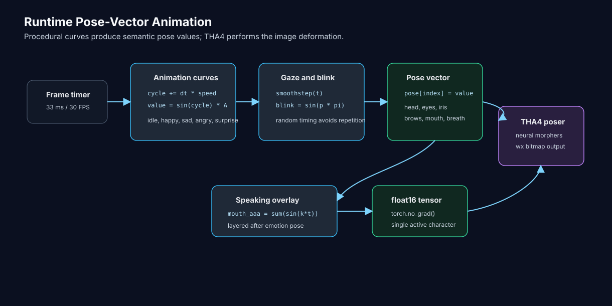
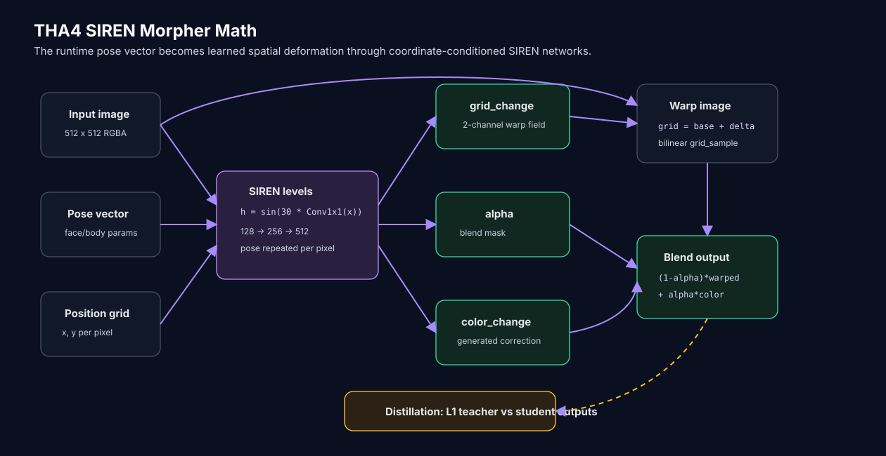

# Animation Math

This page explains the procedural math Vbot uses to drive THA4 avatar motion at runtime.

Vbot does not run a physics simulation for the avatar. It builds a THA4 pose vector every frame, fills that vector with values from lightweight animation curves, and lets the THA4 poser render the resulting character frame.

For the full runtime architecture, see [ANIMATION.md](ANIMATION.md). For THA4 training and GPU optimization, see [THA4_OPTIMIZATION.md](THA4_OPTIMIZATION.md).

## Core Idea

Every frame follows the same pattern:



The animation code treats motion as a set of bounded control signals:

```text
cycle = (cycle + delta_time * speed) mod (2 * pi)
value = offset + sin(cycle * multiplier) * amplitude
```

Those values become THA4 pose parameters such as:

- face rotation: `head_x`, `head_y`, `neck_z`
- body rotation: `body_y`, `body_z`
- eyes: `eye_wink`, `eye_happy_wink`, `eye_surprised`, `eye_relaxed`, `eye_unimpressed`
- iris: `iris_small`, `iris_rotation_x`, `iris_rotation_y`
- eyebrows: `eyebrow_happy`, `eyebrow_angry`, `eyebrow_troubled`, `eyebrow_raised`
- mouth: `mouth_aaa`, `mouth_ooo`, `mouth_delta`, `mouth_raised_corner`, `mouth_lowered_corner`
- breathing: `breathing`

The final vector is sent to THA4 as a `float16` tensor so the runtime controller stays light.

## Frame Timing

The avatar panel runs on a wx timer at about 30 FPS:

```text
timer interval = 33 ms
delta_time = current_time - last_update_time
```

Using `delta_time` keeps motion tied to elapsed time instead of frame count. If one frame is late, the next update still advances the animation by the real time that passed.

## Pose Vector Composition

At the start of each frame, Vbot creates a zeroed pose:

```text
pose = [0.0] * poser.num_parameters
```

Then it writes values into parameter indices resolved from THA4 categories:

```text
pose[index("head_x")] = animation_values["head_x"]
pose[index("mouth_aaa")] = mouth_open
pose[index("eye_wink")] = blink
```

This matters because the animation system does not directly deform pixels. It controls semantic THA4 parameters, and THA4 turns those parameters into the rendered avatar.

## Oscillators

Most motion is built from simple sine oscillators. A sine wave is useful here because it creates smooth acceleration and deceleration without extra keyframes.

Generic form:

```text
phase = (phase + delta_time * speed) mod (2 * pi)
motion = sin(phase) * amplitude
```

For one-sided controls, the code maps `[-1, 1]` into `[0, 1]`:

```text
motion = (sin(phase) * 0.5 + 0.5) * amplitude
```

That pattern is used for controls that should not go negative, such as eye sparkle, droop amount, brow raise amount, and mouth opening.

## Mathematical Foundation

The runtime controller is best understood as harmonic-oscillator procedural animation. Each moving part is modeled as a small signal:

```text
x(t) = A * sin(wt + phi) + b
```

Where:

| Symbol | Meaning in Vbot |
| --- | --- |
| `A` | amplitude, or how far the parameter moves |
| `w` | angular speed, controlled by each animation state's speed constant |
| `t` | elapsed time |
| `phi` | phase offset, either explicit or created by using different cycles/frequency multipliers |
| `b` | baseline offset, used for expressions such as sad head tilt or rounded surprise mouth |

The animation files implement this with cycle variables:

```text
cycle = (cycle + delta_time * speed) mod (2 * pi)
value = sin(cycle) * amplitude
```

Some idle code uses a normalized cycle in `[0, 1]` and multiplies by `2 * pi` at evaluation time:

```text
breathing_cycle = (breathing_cycle + delta_time * speed) mod 1.0
breathing = sin(breathing_cycle * 2 * pi) * 0.5 + 0.5
```

Both forms represent the same idea: keep a phase value moving forward with real time, wrap it at the end of a full cycle, then evaluate a smooth periodic function.

## Wave Superposition

The reason the avatar does not look like one rigid sine wave is superposition. Multiple oscillators are layered on the same pose parameter or related body parts.

Example from happy movement:

```text
bounce = sin(bounce_cycle) * bounce_amount
head_y = (sin(head_cycle) * head_amount + bounce) * 0.5
```

The head's vertical motion is not just `sin(head_cycle)`. It is the sum of a primary head oscillator and a secondary bounce oscillator.

Speaking uses the same idea:

```text
mouth_aaa =
    0.2
    + sin(talk_cycle) * 0.2
    + sin(talk_cycle * 1.5) * 0.05
    + sin(talk_cycle * 0.5) * 0.05
```

Those frequency multipliers make the pattern less obviously repetitive. In math terms, it is a small Fourier-style composition: complex motion built by adding simpler sinusoidal components.

## Why Use `2 * pi`

The sine function completes one full cycle over `2 * pi` radians:

| Phase | `sin(phase)` | Animation Meaning |
| --- | --- | --- |
| `0` | `0` | neutral midpoint |
| `pi / 2` | `1` | positive peak |
| `pi` | `0` | neutral midpoint |
| `3 * pi / 2` | `-1` | negative peak |
| `2 * pi` | `0` | back to start |

Keeping cycle values in a `0` to `2 * pi` range means the variable directly represents an angle in radians. It also makes phase offsets and frequency multipliers easier to reason about.

## Range Transformation

Raw sine output is centered around zero:

```text
sin(phase) in [-1, 1]
```

Some pose parameters can use negative and positive values, such as head rotation. Others should stay non-negative, such as mouth openness or eye expression intensity.

For those one-sided controls, Vbot maps the sine output into `[0, 1]`:

```text
mapped = sin(phase) * 0.5 + 0.5
```

| Phase | Raw Sine | Mapped Value |
| --- | --- | --- |
| `0` | `0.0` | `0.5` |
| `pi / 2` | `1.0` | `1.0` |
| `pi` | `0.0` | `0.5` |
| `3 * pi / 2` | `-1.0` | `0.0` |

That is why `* 0.5 + 0.5` cannot be replaced with `* 1.0`. The scale-and-shift operation changes the valid range, not just the intensity.

## Blink Pulse

Blinking is a short pulse triggered at random intervals.

```text
time_until_next_blink = random(2.0, 4.0)
blink_progress += delta_time / 0.25
blink = sin(blink_progress * pi)
```

The sine pulse starts at 0, rises to 1 halfway through the blink, then returns to 0. That gives the eyelid a smooth close/open shape.

Many emotion states multiply eye expressions by `(1.0 - blink)`:

```text
eye_happy_wink = eye_sparkle * (1.0 - blink)
eye_surprised = 0.9 * (1.0 - blink)
eye_unimpressed = eye_narrow * (1.0 - blink)
```

That prevents expression-eye parameters from fighting the blink at the same time.

## Idle Gaze Math

Idle animation is the most behavior-like state. It uses weighted random target selection plus easing, so the avatar looks around instead of staring at the center forever.

The idle controller stores a list of interest points:

```text
(-0.8, 0.3), (0.8, 0.3), (-0.8, 0), (0.8, 0), ...
```

Each point has a weight, so upper-left and upper-right points are chosen more often than downward points. When it is time to look somewhere new:

```text
target = weighted_random(interest_points)
target += small_random_offset
distance = sqrt((target_x - current_x)^2 + (target_y - current_y)^2)
next_pause = random(1.5, 2.5) + distance * 0.5
```

Further movements create slightly longer pauses, which makes the gaze feel less mechanical.

## Smoothstep Interpolation

The look transition uses smoothstep easing:

```text
t = progress
t = t * t * (3 - 2 * t)
position = current + (target - current) * t
```

Smoothstep is useful because it starts and ends with low velocity. The avatar does not snap into a new gaze direction; it eases into it.

The head follows the eyes with lag:

```text
head_t = clamp((progress - head_lag) / (1 - head_lag), 0, 1)
head_t = head_t * head_t * (3 - 2 * head_t)
head = current + (target - current) * head_t
```

That means the eyes start moving first, then the head follows slightly later. This small timing offset makes idle motion feel more alive.

## Breathing and Sway

Breathing is a slow periodic signal:

```text
breathing_cycle = (breathing_cycle + delta_time * breathing_speed) mod 1.0
breathing = sin(breathing_cycle * 2 * pi) * 0.5 + 0.5
```

Idle head/body sway uses the same idea:

```text
sway = sin(sway_cycle) * sway_amount
body_y = sin(body_y_cycle) * body_movement_amount + body_y_offset
body_z = sin(body_z_cycle) * body_movement_amount + body_z_offset
```

These signals keep the avatar from freezing during neutral listening states.

## Micro-Movement

Several states add a tiny high-frequency motion on top of the main expression:

```text
micro_movement = sin(time.time() * frequency) * amount
head_x += micro_movement
head_y += micro_movement * scale
```

Examples:

| Emotion | Frequency | Amount | Effect |
| --- | --- | --- | --- |
| Happy | `time * 5` | `0.02` | light energetic movement |
| Sad | `time * 2` | `0.01` | slow, weak movement |
| Angry | `time * 8` | `0.03` | sharper tension |
| Surprise | `time * 5` | `0.02` | alert movement |

The different frequencies are part of the acting style. Angry moves faster and tighter; sad moves slower and smaller.

## Emotion Curves

Each emotion uses the same math building blocks, but with different speeds, amplitudes, offsets, and parameter targets.

| Emotion | Motion Strategy |
| --- | --- |
| Happy | Bouncy head motion, smile corners, happy eyes, active iris movement, light breathing |
| Sad | Downward head offset, droop cycle, frown corners, slow breathing, downward iris direction |
| Angry | Faster tension cycle, narrowed eyes, brow furrow, scowl, static direct iris |
| Surprise | Wider eyes, raised brows, rounded mouth, small mouth quiver, iris-size pulse |
| Idle | Weighted gaze targets, smoothstep eye/head transitions, breathing, sway, random blinks |

### Happy

Happy uses a bounce term:

```text
bounce = sin(bounce_cycle) * 0.2
head_x = sin(head_cycle * 1.3) * 0.3 * 0.5
head_y = (sin(head_cycle) * 0.3 + bounce) * 0.5
head_z = sin(head_cycle * 0.7) * (0.3 * 0.5) * 0.5
```

The mouth and brow use one-sided sine curves:

```text
mouth_open = (sin(mouth_open_cycle) * 0.5 + 0.5) * 0.8
brow_raise = (sin(brow_cycle) * 0.5 + 0.5) * 0.4
```

Iris motion is circular-ish:

```text
iris_x = sin(iris_cycle) * 0.3 + bounce * 0.1
iris_y = cos(iris_cycle) * 0.3 + bounce * 0.15
```

### Sad

Sad uses slow cycles and a constant downward offset:

```text
head_down_offset = -0.4
droop = sin(droop_cycle) * 0.4
head_x = (sin(head_cycle * 0.7) * 0.3 - 0.5) * 0.5 + head_down_offset
head_y = (sin(head_cycle) * 0.3 + droop) * 0.5
```

The mouth is mostly a frown with a small quiver:

```text
mouth_quiver = sin(mouth_quiver_cycle) * 0.1
mouth_lowered_corner = 1.1
mouth_delta = mouth_quiver
```

### Angry

Angry uses higher-frequency tension:

```text
tension = sin(tension_cycle) * 0.3
head_x = sin(head_cycle * 1.5) * 0.4 * 0.5
head_y = (sin(head_cycle) * 0.4 + tension) * 0.5
```

The eyes and brows pulse but stay intense:

```text
eye_narrow = (sin(eye_narrow_cycle) * 0.5 + 0.5) * 0.9
brow_furrow = (sin(brow_furrow_cycle) * 0.5 + 0.5) * 1.0
mouth_delta = sin(mouth_tense_cycle) * 0.2 + 0.5
```

### Surprise

Surprise biases the head upward with `abs(...)`:

```text
bounce = sin(bounce_cycle) * 0.2
head_y = abs(sin(head_cycle) * 0.3 + bounce) * 0.5
```

The mouth and iris use small pulses:

```text
mouth_ooo = 0.6 + sin(mouth_cycle) * 0.02
mouth_delta = sin(mouth_cycle * 1.5) * 0.02
iris_small = -0.3 + abs(sin(iris_cycle)) * 0.08
```

## Speaking Mouth Overlay

Speaking animation is layered after the emotion pose. This lets the avatar keep its emotional expression while the mouth moves during TTS playback.

The mouth overlay uses three related oscillators:

```text
talk_speed = 12.0
talk_cycle = current_time * talk_speed

mouth_aaa =
    0.2
    + sin(talk_cycle) * 0.2
    + sin(talk_cycle * 1.5) * 0.05
    + sin(talk_cycle * 0.5) * 0.05

mouth_aaa = clamp(mouth_aaa, 0.1, 0.5)

mouth_ooo = sin(talk_cycle * 0.7) * 0.15 + 0.1
mouth_delta = sin(talk_cycle * 0.9) * 0.1
```

This is not phoneme-perfect lip sync. It is an expressive procedural approximation:

- `mouth_aaa` controls the main open/close motion
- `mouth_ooo` adds rounded-mouth variation
- `mouth_delta` shifts mouth shape so it does not look like a single repeating flap
- the three frequencies avoid a perfectly repetitive motion
- clamping prevents the mouth from opening too far or fully collapsing

## Clamping

Many outputs are clamped before entering the pose vector:

```text
value = max(min(value, upper), lower)
```

This keeps THA4 parameters in a stable range. Different emotions use different ranges:

| Parameter | Example Range |
| --- | --- |
| Happy head rotation | `[-1.0, 1.0]` |
| Surprise `head_x` | `[-0.3, 0.3]` |
| Surprise `head_y` | `[-0.2, 0.5]` |
| Speaking `mouth_aaa` | `[0.1, 0.5]` |

The result is expressive motion without sending extreme parameter values into the neural poser.

## THA4 Neural Morpher Math

The runtime curves above do not directly move pixels. They produce the pose vector. THA4 then uses neural morphers to turn that pose vector into image deformation.



There are two different uses of sine in the avatar stack:

| Layer | Sine Role |
| --- | --- |
| Vbot runtime controller | Uses `math.sin(...)` to create time-based expression and mouth motion |
| THA4 SIREN morphers | Uses sine activations inside neural networks to model spatial image deformation |

### Coordinate Plus Pose Input

The SIREN morphers receive image coordinates and pose values together.

For each pixel, the morpher builds an input like:

```text
input_pixel = [x, y, p_1, p_2, ..., p_n]
```

Where:

- `x, y` come from an affine identity grid over the image plane
- `p_1 ... p_n` are the THA4 pose parameters repeated across the image
- face morpher uses a pose slice of 39 parameters
- body morpher uses 45 pose parameters in the mode used by this project

In code, this appears as:

```text
position_and_pose = concat(position_grid, repeated_pose_image)
```

This is important: THA4 is not just receiving "happy" or "sad." It receives a dense numeric pose vector, then predicts what every pixel should do under that pose.

### SIREN Activation

The SIREN layer uses sine as its neural activation:

```text
h_next = sin(omega_0 * Conv1x1(h))
```

In this codebase, `omega_0` defaults to `30.0`. The first layer and later layers use different initialization ranges so the sine activations stay numerically useful during training.

SIREN-style networks are good for representing high-frequency spatial detail. That makes them a natural fit for avatar morphing, where small changes around the eyes, mouth, hair edges, and silhouette matter.

### Face Morpher

The face morpher takes:

```text
[x, y, 39 face pose values]
```

and returns an RGBA-like output for face deformation at 128 x 128 resolution.

Conceptually:

```text
face_output = SIREN([position, face_pose])
```

This is the neural counterpart to the runtime pose math. Vbot decides "how much mouth / eye / brow / head parameter should be active"; the face morpher learns how that numeric pose should change the image.

### Body Morpher

The body morpher is multi-level:

```text
128 x 128 -> 256 x 256 -> 512 x 512
```

At each level, the network combines:

```text
previous_features + position_grid + repeated_pose
```

The final layer predicts:

```text
grid_change: 2 channels
alpha:       1 channel
color_change: image channels
```

Then THA4 applies the image warp:

```text
grid = base_grid + grid_change
warped_image = bilinear_sample(input_image, grid)
```

And blends the warped image with generated color:

```text
blended_image = (1 - alpha) * warped_image + alpha * color_change
```

So the final avatar frame combines two learned effects:

- geometric deformation through `grid_change`
- appearance correction through `alpha` and `color_change`

This is why the runtime pose vector can create expressive movement without hand-authoring every pixel deformation.

### Distillation Loss

The THA4 student morphers are trained against teacher poser outputs using L1 losses.

The generic L1 form is:

```text
L1 = weight * mean(abs(expected - actual))
```

For the body morpher, the repository defines loss terms around:

- full blended image
- warped image
- grid change
- color change

For the face morpher, the training loss includes:

```text
full_image_L1 + 20.0 * masked_eye_mouth_L1
```

That heavier eye/mouth mask is especially relevant to Vbot because the runtime animation depends heavily on expressive eyes and speech-mouth motion.

## Evidence Trail

| Source | What It Adds |
| --- | --- |
| [research-paper/math_in_animation.md](research-paper/math_in_animation.md) | Harmonic oscillator, superposition, range transformation, blink, breathing, and emotion-tuning rationale |
| [tha4/app/animations](tha4/app/animations) | Runtime emotion curves and idle gaze math |
| [utils/avatar.py](utils/avatar.py) | Pose-vector construction and speaking-mouth overlay |
| [tha4/nn/siren/vanilla/siren.py](tha4/nn/siren/vanilla/siren.py) | SIREN sine activation implementation |
| [tha4/nn/siren/morpher/siren_morpher_03.py](tha4/nn/siren/morpher/siren_morpher_03.py) | Body morpher grid/color/alpha math |
| [tha4/nn/siren/face_morpher/siren_face_morpher_00.py](tha4/nn/siren/face_morpher/siren_face_morpher_00.py) | Face morpher coordinate-plus-pose input |

## Why It Works

The runtime math is intentionally simple:

- sine curves create smooth periodic movement
- random intervals prevent robotic repetition
- smoothstep interpolation makes gaze shifts feel deliberate
- blink masking prevents eye expressions from fighting eyelid closure
- emotion-specific amplitudes and frequencies create distinct acting styles
- speaking-mouth overlays keep TTS playback visually active
- SIREN morphers convert the numeric pose into learned image deformation
- THA4 handles the hard image deformation after Vbot supplies the pose vector

In short: Vbot uses procedural control signals for timing and personality, then relies on THA4 for the neural rendering step.
