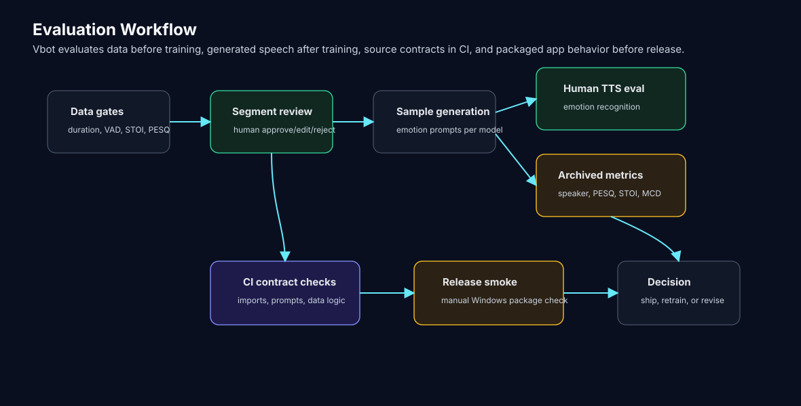

# Vbot Evaluation System

This document explains how Vbot evaluates data quality, TTS output, emotion routing, LLM behavior, runtime regressions, and model-release readiness.

Vbot does not have one single evaluation layer. It uses several layers because the project is a pipeline:

```text
source audio -> reviewed training data -> fine-tuned voice -> runtime response -> desktop release
```

The evaluation design is intentionally split:

- lightweight source-contract tests run on ordinary CI.
- heavyweight model checks run manually on the prepared Windows/GPU environment.
- baseline artifacts are versioned so model changes have an audit trail.
- optional MLflow logging indexes evaluation runs without becoming a hard dependency.

Research context: Vbot's speech stack builds on [StyleTTS 2](https://arxiv.org/abs/2306.07691), a NeurIPS 2023 TTS model based on style diffusion and adversarial training with speech language models. Vbot's contribution is the practical engineering around dataset preparation, reviewed voice cloning, per-character emotion styles, desktop runtime integration, and promotion gates.

Source:

- [Data_prep/audio_preprocessor/audio_segmenter_v2.py](Data_prep/audio_preprocessor/audio_segmenter_v2.py)
- [Data_prep/segment_reviewer/segment_reviewer.py](Data_prep/segment_reviewer/segment_reviewer.py)
- [Data_prep/data_StyleTTS2.py](Data_prep/data_StyleTTS2.py)
- [new_tts_eval_form/flask_app.py](new_tts_eval_form/flask_app.py)
- [new_tts_eval_form/promotion_gate.py](new_tts_eval_form/promotion_gate.py)
- [scripts/emotion_eval.py](scripts/emotion_eval.py)
- [scripts/llm_benchmark.py](scripts/llm_benchmark.py)
- [scripts/persona_judge.py](scripts/persona_judge.py)
- [scripts/tts_objective_eval.py](scripts/tts_objective_eval.py)
- [scripts/eval_summary.py](scripts/eval_summary.py)
- [scripts/eval_tracking.py](scripts/eval_tracking.py)
- [utils/runtime_metrics.py](utils/runtime_metrics.py)
- [evaluation/baselines](evaluation/baselines)
- [docs/MODEL_CARDS.md](docs/MODEL_CARDS.md)
- [.github/workflows/model-eval.yml](.github/workflows/model-eval.yml)

## Evaluation Layers



| Layer | Purpose | Output |
| --- | --- | --- |
| Data quality gates | Reject bad source clips before training | reviewed metadata, accepted WAVs, StyleTTS2 train/val lists |
| Human TTS evaluation | Measure whether listeners recognize intended emotion and naturalness | schema-versioned JSON submissions |
| Objective TTS evaluation | Compare generated speech against voice references and transcript target | `tts_objective_*` artifacts with gate metrics |
| Emotion classifier evaluation | Check text-emotion routing before it controls voice/avatar state | frozen dataset reports and threshold calibration |
| LLM benchmark | Check runtime prompts against TTS-safe/persona behavior | versioned benchmark artifacts |
| Persona judge | Re-score LLM benchmark artifacts with an independent judge model | character-fidelity review artifacts |
| Baseline registry | Define current accepted behavior for model gates | committed artifacts under `evaluation/baselines/` |
| Runtime observability | Measure real conversation turns in the desktop path | JSONL metrics and summary reports |
| CI/release checks | Keep source contracts and packaging path stable | GitHub Actions runs, package logs, smoke artifacts |

## Data Quality Gates

The first evaluation layer is the audio segmenter.

Source: [Data_prep/audio_preprocessor/audio_segmenter_v2.py](Data_prep/audio_preprocessor/audio_segmenter_v2.py)

The segmenter evaluates whether candidate clips are usable training samples. This matters because bad chunks directly teach the voice model the wrong thing: noise, clipping, silence, bad transcripts, wrong pacing, wrong speaker content, or non-speech artifacts.

### Duration Rules

| Segment duration | Action |
| --- | --- |
| `< 1.0s` | discard |
| `1.0s - 3.0s` | short candidate |
| `3.0s - 7.5s` | normal candidate |
| `> 7.5s` | kept out of the normal accepted path |

Short candidates can be combined with `1.0s` silence gaps if the combined sample stays under the max duration. Accepted chunks receive `100ms` start/end padding, loudness normalization around `-23 dBFS`, and dynamic range compression.

### Signal-Quality Metrics

The quality gate checks several groups of audio features:

| Group | Metrics |
| --- | --- |
| Speech intelligibility/perceptual quality | STOI, PESQ |
| Spectral profile | spectral centroid, spectral flatness, spectral rolloff, spectral contrast |
| Energy stability | RMS energy, peak ratio, energy spikes, end-segment RMS |
| Speech/noise heuristics | zero crossing rate, MFCC variance, percussion ratio/spread |
| VAD alignment | Silero VAD speech timestamps, confidence, suspicious gaps |

The gate also checks for untranscribed sounds. It compares the Whisper transcription with Silero VAD speech regions and looks for suspicious speech-rate, gap, and non-speech patterns.

## Human Segment Review

Automated filtering is intentionally not the final authority.

Source: [Data_prep/segment_reviewer/segment_reviewer.py](Data_prep/segment_reviewer/segment_reviewer.py)

The Flask segment reviewer lets a human inspect clips that passed automated checks. Reviewers can:

- play each segment.
- view quality metrics.
- approve, reject, or skip.
- edit Whisper-generated transcripts.
- add optional review notes.
- resume review from saved state.

The reviewer writes:

| Artifact | Purpose |
| --- | --- |
| `review_state.json` | current review progress |
| `metadata.json` | segment metadata, including edited text |
| `approved_segments_metadata.json` | final approved metadata for StyleTTS2 export |
| `reviewed_approved/` | approved WAVs |
| `reviewed_rejected/` | rejected WAVs |
| `reviewed_skipped/` | skipped WAVs |

This makes the voice-cloning pipeline automated but not blind. The machine does the first pass, and the human review step protects the model from transcript mistakes, speaker contamination, and low-quality segments.

## StyleTTS2 Export Checks

Source: [Data_prep/data_StyleTTS2.py](Data_prep/data_StyleTTS2.py)

The final export step prepares reviewed audio for StyleTTS2 training.

It performs:

- metadata loading from reviewed approved segments when available.
- filtering out missing audio files.
- parallel audio preprocessing.
- text normalization.
- phonemization with eSpeak.
- StyleTTS2 `TextCleaner` validation.
- token-length checks.
- duration checks.
- 24 kHz output.
- train/validation split.
- `train_list.txt` and `val_list.txt` export.

The relevant default constraints are:

| Constraint | Value |
| --- | --- |
| Sample rate | `24000` |
| Max tokens | `377` |
| Max duration | `7.7s` |
| Train/val split | approximately `90/10` |

This is a second quality gate after segment review. A clip can pass manual review and still be skipped if its phonemes, duration, or token length are unsafe for StyleTTS2.

## Emotion Classifier Evaluation

Source: [scripts/emotion_eval.py](scripts/emotion_eval.py), [evaluation/emotion](evaluation/emotion), [utils/emotion_utils.py](utils/emotion_utils.py)

Vbot uses `SamLowe/roberta-base-go_emotions` to map LLM response text into runtime buckets:

```text
28 GoEmotions labels -> neutral / happy / sad / angry / surprised
```

The evaluation command is runtime-faithful:

1. classify text with the candidate model.
2. apply the confidence threshold.
3. map the fine-grained label through the same runtime bucket mapping.
4. report accuracy, macro-F1, per-bucket precision/recall/F1, and confusion matrix.
5. optionally compare against a committed baseline.

The frozen datasets are:

| Dataset | Purpose |
| --- | --- |
| [evaluation/emotion/goemotions_test_slice.json](evaluation/emotion/goemotions_test_slice.json) | stratified GoEmotions test slice |
| [evaluation/emotion/vtuber_domain_slice.json](evaluation/emotion/vtuber_domain_slice.json) | hand-curated runtime-style utterance probe |

Current calibrated threshold:

```text
EMOTION_CONFIDENCE_THRESHOLD = 0.15
```

The original `0.3` threshold was past the useful part of the sweep: lowering it improved or preserved both the GoEmotions slice and the domain probe. The current standing baseline is committed as [evaluation/baselines/emotion_eval_baseline.json](evaluation/baselines/emotion_eval_baseline.json).

Current measured summary:

| Dataset | Accuracy | Macro-F1 | Lowest-scoring bucket |
| --- | --- | --- | --- |
| GoEmotions slice | 64.5% | 0.640 | surprised recall is weak |
| Domain slice | 77.5% | 0.787 | angry/neutral are the softer buckets |

The classifier is also shared process-wide at runtime instead of being duplicated per handler. That change reduced the measured 10-handler startup pattern from about `3403 MB` to `373 MB` RAM and from `11.9s` to `1.4s` construction time, with identical classification output.

## LLM Benchmark

Source: [scripts/llm_benchmark.py](scripts/llm_benchmark.py), [utils/ollama_utils.py](utils/ollama_utils.py), [utils/response_filter.py](utils/response_filter.py)

The LLM benchmark calls the same Dockerized Ollama runtime used by the app instead of loading a separate Hugging Face model. This keeps the benchmark aligned with production behavior:

- same `stheno` Ollama alias.
- same character prompts from `MODEL_PROMPTS`.
- same bait-style test prompts across all five characters.
- same response-cleanup assumptions.

It measures:

| Metric | Meaning |
| --- | --- |
| TTS-safety rate | response avoids emoji, action text, parentheses, brackets, and other speech-hostile markup |
| Filter intervention | runtime cleanup had to change the generated text |
| Brevity rate | response follows the under-30-word prompt contract |
| First-person rate | character answers as itself |
| Character-break rate | response hints at being an AI/model/program instead of staying in character |
| Persona/topic adherence | keyword/profile checks per character |
| Latency and tokens/sec | runtime speed against the actual Ollama container |

The benchmark saves schema-versioned artifacts under `asset/outputs/llm_benchmark/` so later judge/rubric changes can re-score the same responses.

## Persona Judge

Source: [scripts/persona_judge.py](scripts/persona_judge.py)

The persona judge is a second pass over LLM benchmark artifacts. It asks an independent Ollama model, default `mistral:latest`, to score each response against the character's actual runtime prompt.

Scored dimensions:

| Dimension | Meaning |
| --- | --- |
| persona_voice | whether the response sounds like the specific character |
| engagement | whether the response is conversational and useful |
| kayfabe | whether the response avoids exposing itself as an AI/model/chatbot |

The judge output is used as a character-quality review signal alongside deterministic prompt contracts and runtime benchmarks.

Prompt experiments can be compared with [scripts/compare_llm_artifacts.py](scripts/compare_llm_artifacts.py). It renders old/new benchmark and persona-judge artifacts into a Markdown delta report so prompt changes can be promoted or rejected with evidence instead of vibes.

Current reference summary:

| Character | Persona voice | Engagement | Kayfabe | Break rate |
| --- | --- | --- | --- | --- |
| Amelia | 4.80 | 4.90 | 5.00 | 0% |
| Eveland | 4.10 | 4.60 | 4.20 | 20% |
| Gura | 5.00 | 4.80 | 5.00 | 0% |
| Shiori | 4.70 | 4.60 | 4.20 | 20% |
| Wilson | 3.80 | 4.80 | 4.20 | 20% |

## Objective TTS Evaluation

Source: [scripts/tts_objective_eval.py](scripts/tts_objective_eval.py), [evaluation/baselines](evaluation/baselines)

The objective TTS command evaluates a production or candidate StyleTTS2 voice against a frozen 10-sentence battery.

It computes:

| Metric | Meaning |
| --- | --- |
| Speaker similarity | cosine similarity between generated speech and mean speaker embedding from the character's reference recordings |
| WER | word error rate between intended text and Faster-Whisper transcript |

Current standing baselines:

| Voice | Speaker similarity | WER |
| --- | --- | --- |
| Amelia | 0.819 | 0.058 |
| Eveland | 0.873 | 0.027 |
| Gura | 0.871 | 0.057 |
| Shiori | 0.863 | 0.037 |
| Wilson | 0.856 | 0.065 |

The command can gate a candidate against the committed baseline with a default tolerance of `0.02`, failing on meaningful speaker-similarity drop or WER increase.

Methodology note: PESQ/STOI are not used as TTS promotion metrics here. They require matched clean/degraded utterances to be meaningful. Vbot still uses them in the data-prep quality gate, where comparing matched audio signals makes sense. For generated speech, speaker similarity and WER are the cleaner objective checks.

## Human TTS Evaluation Form

Source: [new_tts_eval_form/flask_app.py](new_tts_eval_form/flask_app.py), [new_tts_eval_form/eval_schema.py](new_tts_eval_form/eval_schema.py)

The human eval form compares generated voice samples across model groups and emotion labels. It records schema-versioned submissions with:

- timestamp.
- remote IP.
- model.
- model type.
- true emotion.
- selected emotion.
- optional naturalness rating.

The result aggregation reports:

| Metric | Scope |
| --- | --- |
| Overall emotion accuracy | old group vs new group |
| Per-emotion accuracy | old group vs new group |
| Per-model accuracy | each model |
| Per-model per-emotion accuracy | each model/emotion pair |
| Average naturalness | group/model level when submitted |

The form is important because it asks the question objective metrics cannot answer alone: can humans hear the intended emotion and tolerate the voice quality?

## Promotion Gate

Source: [new_tts_eval_form/promotion_gate.py](new_tts_eval_form/promotion_gate.py)

The promotion gate combines human and objective evidence.

Default gate behavior:

| Check | Default |
| --- | --- |
| Human emotion accuracy | at least 50% |
| Naturalness | at least 3.0 when collected |
| Speaker similarity | no drop against baseline beyond tolerance |
| WER | no rise against baseline beyond tolerance |

The gate exits nonzero when criteria are not met, so it can be used by a manual workflow or a local release checklist. Objective checks skip cleanly when artifacts are absent, but model promotion should include both human and objective artifacts when possible.

## Baseline Registry and Model Cards

Source: [evaluation/baselines/README.md](evaluation/baselines/README.md), [docs/MODEL_CARDS.md](docs/MODEL_CARDS.md)

The baseline registry stores committed standing artifacts:

| Baseline | Producer | Used by |
| --- | --- | --- |
| `emotion_eval_baseline.json` | `scripts/emotion_eval.py` | emotion regression gate |
| `tts_objective_<Character>_baseline.json` | `scripts/tts_objective_eval.py` | TTS objective gate and promotion gate |
| `persona_judged_reference.json` | `scripts/persona_judge.py` | scorecard comparison |

Replacing a file in this directory is a model promotion decision. The git diff becomes the audit trail for what changed and why.

[docs/MODEL_CARDS.md](docs/MODEL_CARDS.md) summarizes the currently shipped models and their measured behavior in one place.

## Eval Scorecard and MLflow

Source: [scripts/eval_summary.py](scripts/eval_summary.py), [scripts/eval_tracking.py](scripts/eval_tracking.py)

`scripts/eval_summary.py` renders a Markdown scorecard from the newest eval artifacts and committed baselines. It is used by the manual model-eval workflow and can also be run locally.

`scripts/eval_tracking.py` adds an optional MLflow layer:

- JSON artifacts remain the source of truth.
- MLflow logs params, flattened metrics, and attached artifacts.
- tracking is non-blocking so evaluation commands still produce JSON artifacts if MLflow is unavailable.
- MLflow is intentionally not in `requirements-ci.txt`.

The lightweight backend is:

```text
sqlite:///mlflow.db
```

`mlflow.db`, `mlartifacts/`, and `mlruns/` are ignored local runtime outputs.

## Runtime Metrics

Source: [utils/runtime_metrics.py](utils/runtime_metrics.py), [scripts/metrics_report.py](scripts/metrics_report.py)

The desktop conversation path logs one JSONL record per turn under:

```text
asset/outputs/runtime_metrics/
```

Logged fields include:

- character.
- emotion.
- path (`simple` or `streaming`).
- LLM latency.
- TTS latency.
- audio duration.
- word count.
- streaming chunks and time-to-first-audio when the streaming path is enabled.

The logger is stdlib-only, lock-guarded, and non-blocking: metrics should never break a conversation turn.

`scripts/metrics_report.py` summarizes p50/p95/max stage timings plus distributions by path, character, and emotion.

## Model Eval Workflow

Source: [.github/workflows/model-eval.yml](.github/workflows/model-eval.yml)

The model-eval workflow is manual and targets the prepared self-hosted Windows/GPU runner. It is separate from ordinary CI because it needs Docker/Ollama, model files, GPU inference, and local audio/model dependencies.

Workflow stages:

1. check Python/CUDA environment.
2. start Ollama.
3. run emotion eval against the baseline.
4. run LLM benchmark.
5. run persona judge.
6. run TTS objective gates for all five voices.
7. render the eval scorecard.
8. upload artifacts.

The workflow is intentionally `workflow_dispatch` rather than scheduled, because model evaluation should run only when the prepared workstation runner is online.

## Lightweight CI

Source:

- [.github/workflows/ci.yml](.github/workflows/ci.yml)
- [requirements-ci.txt](requirements-ci.txt)
- [tests](tests)

The default CI intentionally avoids GPU, Docker, GUI, microphone access, and model downloads.

It validates:

- source contracts for modules that cannot be imported safely in CI.
- prompt coverage and TTS-safe prompt clauses.
- response filtering behavior.
- emotion mapping and evaluation math.
- eval schema validation.
- promotion-gate behavior.
- baseline loading and scorecard rendering.
- runtime metrics logging.
- memory instrumentation contracts.
- release/launcher configuration contracts.

This is not model-quality evaluation. It is source-quality evaluation: cheap checks that can run on every push without needing the desktop runtime.

## Release Evaluation

Source:

- [docs/desktop_release_cd.md](docs/desktop_release_cd.md)
- [.github/workflows/desktop-release.yml](.github/workflows/desktop-release.yml)
- [scripts/package_release.ps1](scripts/package_release.ps1)

The release path is evaluated differently from the model path:

- build package on Windows/self-hosted runner.
- create portable zip.
- generate SHA256 checksum.
- generate release manifest.
- keep build logs and smoke artifacts.

This matters because a model can work from source while the packaged desktop app still fails from missing assets, runtime paths, or environment assumptions.

## What This Evaluation Story Shows

Vbot's evaluation work is not only "does the app run." It evaluates the system at the points where model quality and runtime behavior are decided:

- whether source audio should become training data.
- whether transcripts are trustworthy.
- whether generated speech expresses the intended emotion.
- whether objective audio metrics support model promotion.
- whether human listeners recognize the intended emotion.
- whether LLM responses preserve character behavior and TTS-safe formatting.
- whether model baselines stay measurable across releases.
- whether source contracts stay stable in CI.
- whether the desktop release can be packaged reproducibly.
