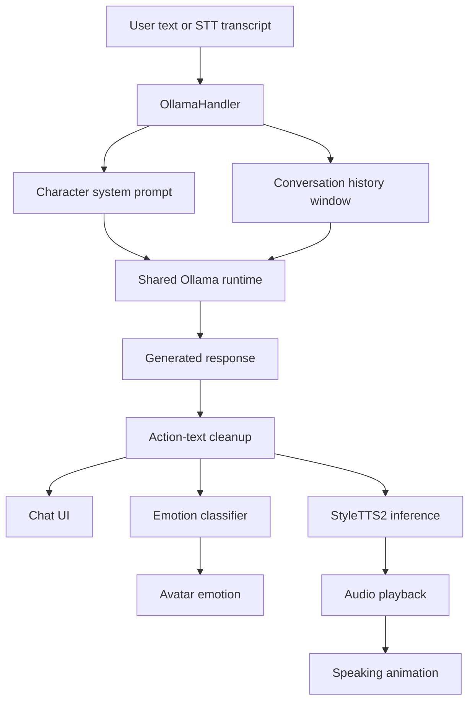
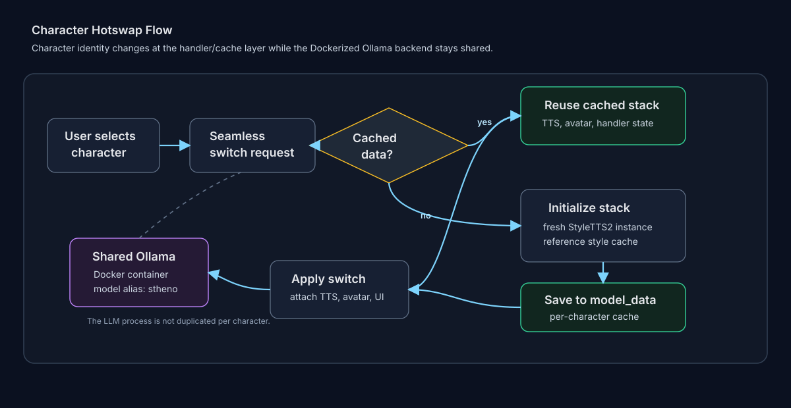

# Vbot LLM Runtime

This document explains how Vbot uses an LLM at runtime without loading a separate language model for every character.

The main design choice is simple: Vbot keeps one shared Ollama backend and swaps character behavior at the prompt and handler layer.

Source:

- [utils/ollama_utils.py](utils/ollama_utils.py)
- [utils/response_filter.py](utils/response_filter.py)
- [utils/streaming_pipeline.py](utils/streaming_pipeline.py)
- [utils/docker_utils.py](utils/docker_utils.py)
- [utils/seamless_interface.py](utils/seamless_interface.py)
- [utils/initialization_utils.py](utils/initialization_utils.py)
- [scripts/llm_benchmark.py](scripts/llm_benchmark.py)
- [scripts/persona_judge.py](scripts/persona_judge.py)
- [tests/test_prompt_contract.py](tests/test_prompt_contract.py)
- [tests/test_response_filter.py](tests/test_response_filter.py)
- [tests/test_streaming_pipeline.py](tests/test_streaming_pipeline.py)

## Runtime Role

The LLM is responsible for the character's text response only. It does not directly synthesize voice, classify emotion, or animate the avatar.

At runtime the LLM output becomes input for several downstream systems:



This separation is important because a character switch should not mean "load a new LLM." It should mean "reuse the same language backend with a different character contract."

## Shared Ollama Backend

Vbot uses Docker to manage the Ollama runtime:

- container name: `ollama`
- image: `ollama/ollama`
- host port: `11500`
- container port: `11434`
- persistent Docker volume: `ollama:/root/.ollama`
- runtime model alias: `stheno`

`DockerHandler.ensure_ollama_container()` starts an existing container when possible, creates one if needed, waits for the API to respond, checks `ollama list`, pulls the model if missing, copies it to the `stheno` alias, then removes the long source name.

The model source in the current Docker setup is:

```text
hf.co/featherless-ai-quants/bluuwhale-L3-SthenoMaidBlackroot-8B-V1-GGUF:bluuwhale-L3-SthenoMaidBlackroot-8B-V1-Q4_K_M.gguf
```

The Python app talks to Ollama through:

```text
OLLAMA_HOST=http://localhost:11500
OLLAMA_TIMEOUT=60
```

The practical result is that Vbot does not duplicate LLM weights across characters. Character identity is handled above the LLM process.

## Character Prompt Layer

Character behavior is stored in `MODEL_PROMPTS` inside [utils/ollama_utils.py](utils/ollama_utils.py).

The current prompt set covers:

| Character | Prompt purpose |
| --- | --- |
| Amelia | Time-traveling detective persona, concise speech, no action text |
| Eveland | Bookish novelist persona, gentle/chaotic balance, concise speech |
| Gura | Playful shark-themed persona, high-energy concise speech |
| Shiori | Archivist/story-focused persona, mysterious concise speech |
| Wilson | Reliable supportive companion persona, warm concise speech |

Each prompt has two jobs:

- define the character's speaking style and topic tendencies.
- constrain output for TTS by banning emojis, parentheses, asterisks, and action text.

The TTS constraint matters as much as the personality instruction. A response like `*laughs softly*` might look natural in a text chat, but it becomes bad speech input when sent to StyleTTS2.

## Message Construction

The Ollama call builds messages in this order:

```text
system prompt
recent message history
current user message
```

The runtime constants are:

| Constant | Value | Purpose |
| --- | --- | --- |
| `MAX_HISTORY` | `10` | Caps recent conversation messages |
| `MAX_LENGTH` | `150` | Caps generated response length through `num_predict` |
| `OLLAMA_TIMEOUT` | `60` | Request timeout in seconds |

The history cap is important because the generated response is not the final product. Long responses increase LLM time, emotion-classification time, TTS latency, subtitle complexity, and audio playback duration.

## Character Switching and LLM State

During character switching, [utils/seamless_interface.py](utils/seamless_interface.py) handles the active handler swap.



The key sequence is:

1. stop the current handler's active processing flag.
2. update `selected_avatar`.
3. reuse cached `model_data[new_model]` if already loaded.
4. load a new character stack on demand if missing.
5. set `VOICE_TYPE` for avatar asset resolution.
6. recreate/select the matching avatar in the GUI.
7. attach the new character's `OllamaHandler` as the send callback.
8. attach the correct TTS model before calling `set_model()`.
9. call `set_model(new_model)` so the handler clears history and rebuilds its `InferenceHandler`.
10. attach the audio processor if it is already available.

`OllamaHandler.set_model()` is intentionally stateful:

- it accepts only known keys in `MODEL_PROMPTS`.
- it updates `self.model_name`.
- it clears `self.message_history`.
- it rebuilds the TTS `InferenceHandler` with the character's TTS model.
- it refreshes the character-specific emotion config.

That prevents conversation bleed between characters. If the user talks to Amelia and then switches to Gura, Gura does not inherit Amelia's history.

## Stable Response Path

The stable default runtime path is `handle_text_input_simple()`.

It does the following:

1. rejects new input if the handler is already processing or speaking.
2. disables GUI input controls.
3. writes the user message to chat.
4. gets the current character prompt.
5. calls `call_ollama_stream()`.
6. collects the final response chunk.
7. filters action text and incomplete text.
8. writes the cleaned response to chat.
9. appends the cleaned assistant response to message history.
10. sends the cleaned text to `_simple_tts_playback()` unless sentence-streaming TTS is explicitly enabled.

Even though `call_ollama_stream()` uses Ollama streaming, the stable path currently treats the final assembled response as the speech unit. That is a practical tradeoff: simpler timing, fewer partial TTS calls, and fewer chances for audio/subtitle desync.

## Response Cleanup

Response cleanup protects the speech pipeline from text that belongs in roleplay but not in generated audio.

Source: [utils/response_filter.py](utils/response_filter.py)

`OllamaHandler._filter_action_text()` delegates to the pure cleanup function so the behavior can be tested without importing the desktop/GPU/audio stack.

It removes:

- asterisk-wrapped action text
- remaining asterisks
- parenthesized text
- bracketed text
- emoji
- repeated whitespace

It also tries to ensure the final text ends naturally:

- keeps complete sentences when possible.
- adds final punctuation when missing.
- trims suspicious tiny trailing fragments.
- returns a safe fallback if filtering removes everything.

This is a small but important layer. The prompt asks the model not to output action text, but the runtime still defends itself when the model does.

## LLM to TTS Coupling

The LLM response is not spoken directly from the raw Ollama output. The pipeline uses the cleaned response:

```text
Ollama response
  -> action-text filter
  -> chat display
  -> emotion classifier
  -> character-specific StyleTTS2 style
  -> speech waveform
  -> audio playback thread
  -> avatar speaking animation
```

`_simple_tts_playback()` also limits very long text to about 100 words before TTS. This prevents oversized text from creating tensor-shape or latency problems in the speech stack.

## Sentence-Streaming TTS Path

Source: [utils/streaming_pipeline.py](utils/streaming_pipeline.py), [utils/ollama_utils.py](utils/ollama_utils.py)

The default path still synthesizes the full cleaned response as one speech unit. Vbot also has an opt-in sentence-streaming TTS path:

```text
VBOT_STREAMING_TTS=1
```

The streaming path is designed around the measured TTS latency shape: StyleTTS2 has a noticeable fixed cost per synthesis call, then relatively cheap extra words. That means the system should not split every tiny phrase into a separate TTS call. Instead, `chunk_sentences()` uses a conservative batching policy:

- first chunk is one sentence to reduce time to first audio.
- later chunks can batch up to two sentences or about 30 words.
- tiny trailing fragments merge backward.
- oversized sentences stay whole instead of being split into unsafe fragments.

`StreamingTTSPipeline` then uses a producer/consumer structure:

```text
cleaned response
  -> sentence chunks
  -> producer synthesizes chunks ahead
  -> bounded queue
  -> consumer plays chunks in order
  -> metrics report
```

The runtime keeps emotion classification once per full response so all chunks use a consistent character/emotion style. The GUI subtitle update is scheduled through the Tk main thread, and avatar speaking state spans the whole stream rather than flapping on every chunk.

The path is intentionally feature-flagged because chunked playback has more moving parts than the simple full-response path. It is implemented and tested at the pipeline level, while the default desktop behavior stays conservative.

## LLM Evaluation

Source: [scripts/llm_benchmark.py](scripts/llm_benchmark.py), [scripts/persona_judge.py](scripts/persona_judge.py)

The supported behavioral LLM eval path has two stages:

1. `llm_benchmark.py` sends a fixed prompt battery to the Dockerized `stheno` runtime using the production character prompts.
2. `persona_judge.py` re-scores the benchmark artifact with an independent Ollama judge model.

The benchmark checks runtime-facing behavior:

| Metric | Purpose |
| --- | --- |
| TTS safety | catches emoji, parentheses, asterisks, action text, and other bad speech input |
| Filter intervention | reports how often cleanup had to repair a response |
| Brevity | checks whether prompts stay near the under-30-word contract |
| Persona adherence | checks character-specific topic/style signals |
| Character continuity | catches "I am an AI/model/chatbot" style persona breaks |
| Latency/tokens per second | measures the actual Ollama path rather than an offline model copy |

The persona judge then scores persona voice, engagement, and kayfabe as a review layer on top of deterministic prompt contracts.

## Why This Design Matters

The LLM design solves three runtime problems:

| Problem | Design response |
| --- | --- |
| Multiple characters would duplicate LLM memory | One Ollama backend, character prompts at handler layer |
| Character switches can leak conversation context | `set_model()` clears history on switch |
| TTS cannot safely speak roleplay markup | Prompt constraints plus runtime action-text filtering |
| Long responses slow every downstream stage | `MAX_LENGTH`, prompt brevity, TTS truncation, and opt-in sentence streaming |
| Ollama startup can be brittle | Docker container readiness checks and model alias setup |

## CI Coverage

The lightweight CI does not call Ollama. That is intentional because GitHub-hosted runners should not be expected to run Docker, model downloads, or GPU-backed desktop inference.

Instead, the CI-safe tests parse and inspect source contracts:

- [tests/test_prompt_contract.py](tests/test_prompt_contract.py) checks that every character prompt contains the required TTS-safe constraints, first-person framing, character lock, key-traits section, and roster coverage.
- [tests/test_response_filter.py](tests/test_response_filter.py) checks action-text/emoji cleanup without importing the desktop stack.
- [tests/test_streaming_pipeline.py](tests/test_streaming_pipeline.py) checks sentence chunking and producer/consumer behavior.
- [tests/test_llm_benchmark.py](tests/test_llm_benchmark.py) checks benchmark scoring and artifact shape without calling Ollama.
- [tests/test_persona_judge.py](tests/test_persona_judge.py) checks judge prompt construction and JSON parsing.

Behavioral LLM evaluation happens through [scripts/llm_benchmark.py](scripts/llm_benchmark.py) and [scripts/persona_judge.py](scripts/persona_judge.py), usually on the prepared local runtime or through the manual model-eval workflow.
