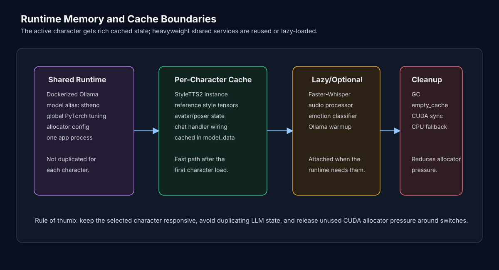

# Vbot Memory Management

This document explains how Vbot manages runtime memory and VRAM across a desktop AI stack that includes Ollama, StyleTTS2, Faster-Whisper, RoBERTa emotion classification, and THA4 avatar rendering.

The goal is not to keep every possible model resident at all times. The goal is to keep the active character responsive while avoiding unnecessary duplicate model state.

Source:

- [utils/performance_boost.py](utils/performance_boost.py)
- [utils/initialization_utils.py](utils/initialization_utils.py)
- [utils/preloader.py](utils/preloader.py)
- [utils/seamless_interface.py](utils/seamless_interface.py)
- [utils/inference_styleTTS2.py](utils/inference_styleTTS2.py)
- [utils/audio_utils.py](utils/audio_utils.py)
- [utils/avatar.py](utils/avatar.py)
- [utils/emotion_utils.py](utils/emotion_utils.py)
- [scripts/memory_debug.py](scripts/memory_debug.py)
- [docs/THA4_Performance_Summary.md](docs/THA4_Performance_Summary.md)
- [docs/THA4_Optimization_Recommendations.md](docs/THA4_Optimization_Recommendations.md)

## Runtime Pressure Points

Vbot has several heavy components:

| Component | Pressure |
| --- | --- |
| StyleTTS2 | model weights, diffusion inference, mel/style tensors |
| RoBERTa GoEmotions | shared transformer classifier pipeline |
| Faster-Whisper | CPU STT model, audio buffers |
| THA4 avatar | character image, poser, frame tensors |
| Ollama | LLM runtime outside the Python process |
| Audio playback | waveform arrays, stream state |

The runtime therefore uses a layered memory strategy:



## Global PyTorch Tuning

Source: [utils/performance_boost.py](utils/performance_boost.py)

`MemoryManager.optimize_pytorch()` applies global runtime settings when CUDA is available:

- enables flash SDP.
- limits PyTorch to a fraction of GPU memory.
- sets `PYTORCH_CUDA_ALLOC_CONF`.
- sets `CUDA_LAUNCH_BLOCKING=0`.
- disables tokenizer parallelism warnings/contention through `TOKENIZERS_PARALLELISM=false`.

The default memory fraction in the runtime utility is:

```text
torch.cuda.set_per_process_memory_fraction(0.4)
```

There is also a low-VRAM mode that lowers this to:

```text
torch.cuda.set_per_process_memory_fraction(0.25)
```

The allocator config is tuned around smaller chunks and more aggressive garbage collection:

```text
max_split_size_mb:128
roundup_power2_divisions:8
garbage_collection_threshold:0.6
```

`torch.cuda.empty_cache()` is used to reduce cached allocator pressure and fragmentation around heavy model operations.

## Aggressive Cleanup Before Initialization

Source: [utils/initialization_utils.py](utils/initialization_utils.py)

Every `InitializationHandler` starts by cleaning memory:

- `memory_manager.clear_cache()`
- `MemoryManager.optimize_pytorch()`
- `MemoryManager.aggressive_vram_cleanup()`

`aggressive_vram_cleanup()` calls `torch.cuda.empty_cache()`, synchronizes CUDA, runs garbage collection several times, and resets peak/accumulated memory stats.

This is done before creating a character stack so a new character is less likely to inherit allocator fragmentation from previous work.

`InitializationHandler.initialize_all()` also records memory checkpoints around startup phases. The TTS load runs under `track_cuda_peak()` so retained and peak CUDA allocation can be attributed to the heaviest sequential load step instead of being guessed later.

## Startup Ordering

Vbot separates startup into critical and optional stages.

Critical:

- Docker/Ollama container readiness.
- fresh StyleTTS2 model creation for the selected character.

Optional/background:

- Ollama connection warmup.
- Whisper audio processor.
- shared RoBERTa emotion classifier.
- reference style caching.

The UI can start after critical components and essential optional components are ready. The audio processor and Ollama handler can still be attached later through lazy getters.

This helps startup feel less blocked by components that are useful but not always immediately needed.

## Fresh TTS Per Character

Source: [utils/initialization_utils.py](utils/initialization_utils.py), [utils/inference_styleTTS2.py](utils/inference_styleTTS2.py)

The code intentionally creates a fresh `StyleTTS2Inference` instance per character instead of sharing one global object across all voices.

Why:

- each character maps to a different Hugging Face checkpoint.
- each character has different reference audio files.
- each character has separate emotion/style parameters.
- sharing the wrong object risks voice leakage or incorrect style reuse.

The boundary is:

```text
character
  -> StyleTTS2 checkpoint
  -> StyleTTS2Inference instance
  -> cache/style/<character>/
  -> emotion reference style tensors
  -> InferenceHandler
```

The instance also carries a short unique runtime ID for debugging so accidental sharing is easier to spot.

## Style Tensor Cache

Source: [utils/inference_styleTTS2.py](utils/inference_styleTTS2.py), [utils/initialization_utils.py](utils/initialization_utils.py)

Computing a StyleTTS2 reference style from a WAV file is avoidable repeated work, so Vbot caches style tensors.

The style cache has two layers:

| Layer | Location |
| --- | --- |
| Memory cache | `self._style_cache` |
| Disk cache | `cache/style/<model_name>/style_cache/*.pt` |

`compute_style()` checks:

1. memory cache.
2. disk cache.
3. recompute from reference audio if missing.
4. store in both memory and disk.

`InitializationHandler._initialize_ref_style()` checks all emotion styles for the active character. If every style is already cached, it loads the neutral style and can skip recomputing the rest.

This is one of the highest-value optimizations because emotion-specific voice styles are reused constantly.

## Shared Emotion Classifier

Source: [utils/emotion_utils.py](utils/emotion_utils.py)

Earlier versions could create multiple RoBERTa pipelines during startup because several handlers needed emotion classification. The current runtime uses one lazy process-wide classifier through `get_shared_emotion_classifier()`.

The ownership split is:

```text
shared process classifier
  -> one loaded Transformers pipeline
  -> many EmotionHandler instances
  -> per-character emotion config remains separate
```

Measured on the 10-handler startup pattern:

| Metric | Before | After |
| --- | --- | --- |
| RAM used by duplicate classifier construction | ~3403 MB | ~373 MB |
| construction time | ~11.9s | ~1.4s |
| classification output | identical | identical |

This is a high-value memory fix because it removes duplicate model state without weakening character-specific routing. Each handler still owns its character config; only the classifier weights are shared.

## On-Demand Character Hotswap

Source: [utils/seamless_interface.py](utils/seamless_interface.py)

The active seamless interface uses on-demand loading plus cached character data.

First selection:

- create an `InitializationHandler`.
- initialize character components.
- create an `OllamaHandler`.
- store everything in `self.model_data[new_model]`.

Later selection of the same character:

- reuse cached `model_data`.
- attach the cached handler and components to the GUI.
- update `VOICE_TYPE`.
- recreate/select the matching avatar.

This gives fast switching after first load without forcing every character to load at startup.

## Why Not Preload Everything?

Source: [utils/preloader.py](utils/preloader.py)

`ModelPreloader` exists and supports loading all characters. It also loads models sequentially by default to avoid GPU pressure.

However, the active seamless path favors on-demand loading because preloading every character can be too heavy for a normal desktop GPU.

The preloader is still useful as supporting infrastructure:

- progress reporting.
- sequential load strategy.
- `cleanup_unused_models(keep_model)`.
- `cleanup_all()`.

The README should describe it as available support, not as the default runtime behavior.

## Ollama Memory Boundary

Source: [utils/docker_utils.py](utils/docker_utils.py), [utils/ollama_utils.py](utils/ollama_utils.py)

The LLM backend is kept out of the Python model stack through Ollama.

This helps because:

- Python does not load one causal LLM per character.
- character switching changes prompts/handlers, not LLM weights.
- the model is stored in a persistent Docker volume.
- the app talks to the Ollama API through HTTP.

The current Docker helper creates the Ollama container and aliases the model as `stheno`.

Note: Docker/Ollama still consumes machine resources. The point is not that the LLM is free. The point is that Vbot avoids duplicating LLM memory inside the Python process for every character.

## Whisper and Audio Memory

Source: [utils/audio_utils.py](utils/audio_utils.py)

The audio processor is optimized for interactive voice input:

- Faster-Whisper model size: `tiny`.
- compute type: `int8`.
- worker count: `1`.
- CPU by default.
- CUDA opt-in through `VBOT_WHISPER_DEVICE=cuda`.
- PyAudio stream reuse.
- small audio chunks for faster interaction.
- sounddevice non-blocking playback.

The CPU default is deliberate and keeps speech recognition lightweight while reserving GPU capacity for TTS and avatar rendering.

The practical tradeoff is acceptable:

- the `tiny` int8 Whisper model is fast enough for interactive STT.
- CPU STT avoids competing with StyleTTS2 and THA4 for GPU memory.
- the GPU remains available for the workloads that benefit more from it.
- CUDA STT remains available as an explicit opt-in.

The audio processor is optional/lazy during startup. If it is not ready when an `OllamaHandler` is created, the handler can try to get it later through the initialization handler.

This reduces startup blocking and avoids making microphone/STT readiness a hard dependency for text chat.

## StyleTTS2 Inference Cleanup

Source: [utils/inference_styleTTS2.py](utils/inference_styleTTS2.py)

StyleTTS2 inference uses several memory-oriented choices:

- cuDNN benchmark enabled for speed.
- device fallback support.
- text length cap before inference.
- token length cap before tensor creation.
- noise tensors created directly on the selected device.
- `torch.inference_mode()` during inference.
- output moved to CPU before returning NumPy audio.
- `torch.cuda.empty_cache()` after inference.

The fallback path keeps the desktop runtime oriented around continuity during model inference.

## Avatar Rendering Memory

Source: [utils/avatar.py](utils/avatar.py), [ANIMATION.md](ANIMATION.md)

The avatar runtime uses THA4 through a wxPython panel.

Memory-related choices:

- cached base character image.
- `torch.float16` pose tensor.
- `torch.no_grad()` during poser inference.
- output detached and moved to CPU before wx bitmap conversion.
- intermediate tensors deleted after frame generation.
- periodic CUDA cache cleanup every 60 rendered frames.
- CUDA cache cleanup when speaking stops and on avatar cleanup.
- AI upscaler disabled for performance.
- fixed 512 x 512 avatar render target.

The avatar renderer can display the cached static character image as a continuity path when neural posing is unavailable.

## Runtime Memory Instrumentation

Source: [utils/performance_boost.py](utils/performance_boost.py), [utils/seamless_interface.py](utils/seamless_interface.py), [scripts/memory_debug.py](scripts/memory_debug.py)

Vbot includes lightweight runtime memory instrumentation:

| Tool | Purpose |
| --- | --- |
| `MemoryManager.log_memory(label)` | prints one-line RAM/CUDA/peak snapshots |
| `track_cuda_peak(label)` | measures retained and peak CUDA allocation across a component load |
| `scripts/memory_debug.py` | prints current memory info, with `--json` for machine-readable output |

The active switch path logs memory around character switching:

- switch start.
- cached switch completion.
- on-demand load completion.

Startup logs include snapshots at major initialization phases, and TTS model loading gets its own peak attribution because it is sequential and expensive enough to measure honestly.

## Training Optimization Notes

Source:

- [docs/THA4_Performance_Summary.md](docs/THA4_Performance_Summary.md)
- [docs/THA4_Optimization_Recommendations.md](docs/THA4_Optimization_Recommendations.md)
- [docs/presentation-for-avatar-training.md](docs/presentation-for-avatar-training.md)

The THA4 training docs discuss a different memory problem: training throughput and memory bandwidth.

The key training insight is that slow training was not only about VRAM size. The docs describe a bandwidth/data-pipeline bottleneck:

- FP32 created unnecessary memory traffic.
- CPU data loading could starve the GPU.
- synchronous transfers left the GPU waiting.
- mixed precision and better data transfer patterns improved utilization.

Recommended training-side ideas include:

- mixed precision.
- pin memory.
- non-blocking GPU transfers.
- persistent dataloader workers.
- prefetching.
- cuDNN benchmark.
- TF32 on supported GPUs.
- memory profiling with `nvidia-smi`, PyTorch profiler, and memory summaries.

These training optimizations are separate from the desktop runtime, but they support the broader project story: Vbot's optimization work is about profiling actual bottlenecks instead of assuming "more VRAM" is the answer.

## Practical Design Summary

Vbot's runtime memory design is based on four rules:

1. Share the LLM backend instead of duplicating it per character.
2. Do not share TTS objects when voice correctness depends on character-specific checkpoints.
3. Cache cheap-to-reuse style tensors instead of recomputing reference styles.
4. Share classifier weights when character correctness does not require duplicate model instances.
5. Load optional systems lazily and clean up aggressively around heavy model operations.
6. Measure runtime memory with instrumentation instead of guessing from symptoms.

This gives Vbot a workable compromise: character-specific voice/avatar behavior without pretending a consumer GPU can comfortably keep every heavy model variant active at once.
