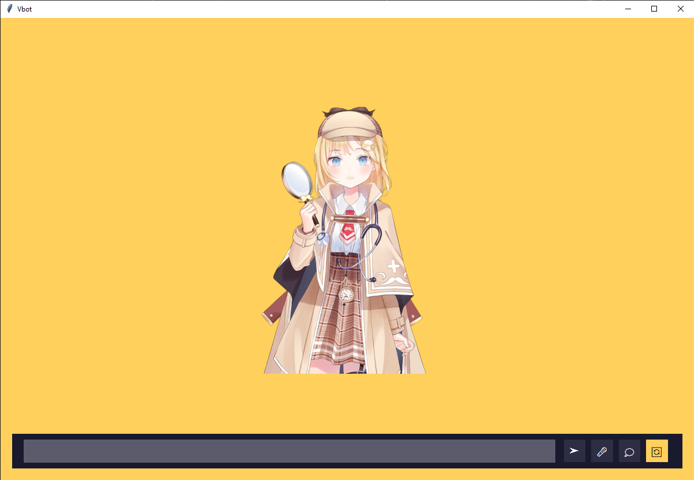

# Senior_Project_1
## Vbot

A VTuber chatbot application that combines AI conversation with animated character avatars. Vbot features speech recognition, natural language processing, and expressive character animations.



## Features

- **Interactive Animated Characters**: Engage with expressive VTuber-style characters
- **Voice Conversation**: Talk to the AI using your microphone
- **Text-to-Speech**: Characters respond with natural-sounding voices
- **Emotional Expressions**: Characters display emotions based on conversation context
- **Character Switching**: Switch between different characters with unique personalities
- **Lip Synchronization**: Character mouth movements match spoken words

## Quick Start

### System Requirements

- Windows 10 (64-bit)
- NVIDIA GPU with at least 8GB VRAM
- Python 3.10
- Docker Desktop

### Installation

1. **Install Docker Desktop and WSL 2**
   - Download [Docker Desktop](https://www.docker.com/products/docker-desktop)
   - Follow Docker's instructions to set up WSL 2

2. **Set up Python environment**
   ```
   python -m venv venv
   venv\Scripts\activate
   pip install -r requirements.txt
   pip install torch==2.5.1 torchvision==0.20.1 torchaudio==2.5.1 --index-url https://download.pytorch.org/whl/cu121
   ```

3. **Start Docker Desktop**
   - Ensure Docker Desktop is running before launching Vbot

### Usage

1. **Launch the application**
   ```
   python Vbot.py
   ```

2. **Interact with the character**
   - Type in the text box and press Enter or click the send button (➤)
   - Click the microphone button (🎤) to use voice input
   - Switch characters using the switch button (🔄)
   - View conversation history with the history button (💭)

## Documentation

For detailed instructions:

- [USER_GUIDE.md](USER_GUIDE.md) - running the portable Windows executable
- [BUILD_INSTRUCTIONS.md](BUILD_INSTRUCTIONS.md) - building and packaging the desktop release
- [docs/desktop_release_cd.md](docs/desktop_release_cd.md) - desktop package flow and release artifact policy
- [docs/mlops_ci_cd_plan.md](docs/mlops_ci_cd_plan.md) - CI/CD, evaluation, and training roadmap

## Troubleshooting

- **First Run**: The first run will take longer as it downloads necessary models (~5GB)
- **Voice Input Issues**: Check microphone permissions in Windows
- **Docker Errors**: Ensure Docker Desktop is running with WSL 2
- **espeak errors**: See [installation guide](https://www.youtube.com/watch?v=BBlivx6o0WM)
