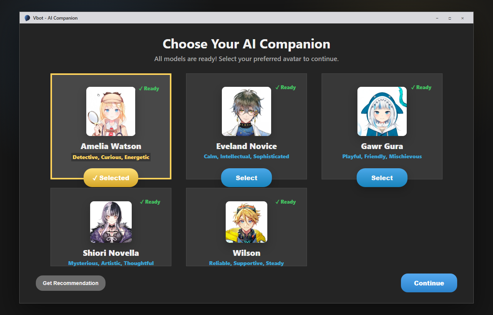
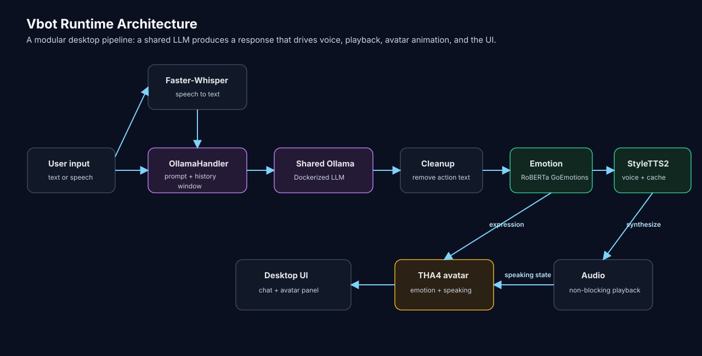
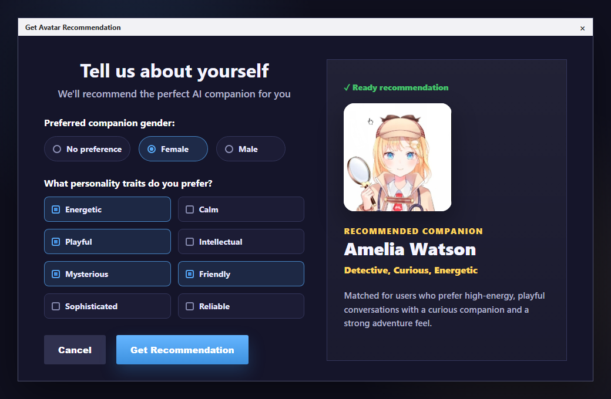
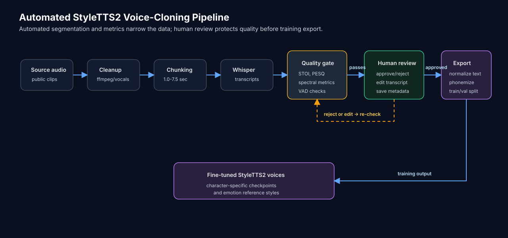

# Vbot

Vbot is a Windows desktop AI character system that combines LLM conversation, speech input, character-specific StyleTTS2 voices, emotion routing, and THA4 avatar animation.

This repository is best read as an implementation case study for optimizing a multi-model AI desktop runtime. The interesting work is not only that Vbot can chat. The harder engineering problem is making several heavy components cooperate in one session:

- one Dockerized Ollama LLM runtime
- multiple selectable AI character personas
- per-character StyleTTS2 checkpoints
- per-character emotion reference styles
- RoBERTa emotion classification
- Faster-Whisper speech input
- THA4 avatar rendering
- non-blocking audio playback
- character hotswapping without rebuilding the entire app state every time
- VRAM and cache management across the whole runtime
- model evaluation gates, runtime metrics, and release workflows



## What This README Prioritizes

This README prioritizes implementation details over setup walkthroughs. Vbot is a multi-model desktop AI prototype, so the most useful part of the project is the engineering behind the runtime:

- how the LLM is isolated and reused instead of duplicated per character
- how each character owns its own TTS stack and style cache
- how avatar switching reuses cached character data after the first load
- how CUDA/VRAM pressure is reduced during model initialization and playback
- how emotion is routed into both voice style and avatar expression
- how the animation layer turns model output into a live character interface
- how training/evaluation/release workflows are separated from normal CI
- how the project treats model changes as measurable releases, not just asset swaps

## Runtime Architecture



## Main Runtime Flow

1. The user chooses a character in the welcome interface.
2. `InitializationHandler` creates the selected character stack.
3. The selected stack is stored in `model_data`.
4. The GUI attaches the character's `OllamaHandler`, `StyleTTS2Inference`, emotion handler, and avatar.
5. User input is sent to Ollama with the selected character prompt.
6. The response is cleaned so TTS does not speak roleplay formatting or incomplete action text.
7. The response is classified with RoBERTa GoEmotions.
8. The emotion chooses a character-specific StyleTTS2 reference style and inference parameters.
9. StyleTTS2 generates speech.
10. Audio playback runs in a separate thread so the GUI does not freeze.
11. Avatar speaking state starts when playback starts and stops after the audio duration.
12. The avatar expression is updated from the detected emotion.

The welcome flow also includes a preference-based avatar recommendation panel for first-time character selection.



## Character Hotswap and Cache Design

The current seamless interface uses on-demand character loading with caching.

Source: [utils/seamless_interface.py](utils/seamless_interface.py), [utils/initialization_utils.py](utils/initialization_utils.py)


The first time a character is selected:

- `SeamlessVbotInterface._handle_model_switch()` creates an `InitializationHandler`.
- `InitializationHandler.initialize_all()` builds the character stack.
- a new `OllamaHandler` is created for that character.
- the resulting data is stored in `self.model_data[new_model]`.

When the same character is selected again:

- the interface checks `self.model_data`.
- if the character key already exists, Vbot skips reinitialization.
- `_apply_model_switch()` immediately reattaches the cached handler, TTS object, audio processor, and avatar state to the GUI.

This makes switching closer to a hotswap after the first load. The system avoids re-downloading or recomputing character state that already exists in memory/disk cache.

Important switch steps:

- current processing is stopped before switching by clearing the active handler state.
- `selected_avatar` is updated immediately to avoid race conditions.
- `VOICE_TYPE` is updated so avatar construction resolves the correct asset folder.
- the chat GUI recreates/selects the correct avatar.
- the new `OllamaHandler` becomes the active send callback.
- the correct TTS model is attached before `set_model()` runs.
- `set_model()` rebuilds the character-specific `InferenceHandler` and clears old conversation history.
- the new audio processor is attached if it has already loaded; otherwise a lazy getter can provide it when ready.

## LLM Runtime Strategy

Vbot does not load one LLM per character. That would waste memory and make switching expensive.

Deep dive: [LLM.md](LLM.md)

Source: [utils/ollama_utils.py](utils/ollama_utils.py), [utils/docker_utils.py](utils/docker_utils.py)

Instead, the system keeps one Ollama runtime behind Docker and swaps character behavior at the handler/prompt layer:

- Docker keeps the Ollama runtime isolated on Windows.
- the Ollama model is stored in a persistent Docker volume.
- each character has a separate prompt in `MODEL_PROMPTS`.
- each `OllamaHandler` owns its current `model_name`, message history, TTS handler, and emotion config.
- `set_model()` clears history on character switch so one character does not inherit another character's conversation.
- response length and history length are capped to keep response time and TTS load controlled.

This keeps the expensive LLM backend shared while allowing the visible character system to change.

## Per-Character TTS Cache Boundaries

The TTS design intentionally avoids accidentally sharing the wrong voice across characters.

Source: [utils/inference_styleTTS2.py](utils/inference_styleTTS2.py), [utils/TTS_utils.py](utils/TTS_utils.py), [utils/initialization_utils.py](utils/initialization_utils.py)

Each character gets a fresh `StyleTTS2Inference` instance:

- the wrapper receives the selected `model_name`.
- `model_name` maps to a character-specific Hugging Face checkpoint.
- the object has a unique runtime id for debugging.
- the cache path is scoped by character: `cache/style/<model_name>/`.
- reference style tensors are cached under that character's `style_cache/` folder.

The one-to-one cache relationship is:

```text
character
  -> StyleTTS2 checkpoint
  -> StyleTTS2Inference instance
  -> emotion reference audio files
  -> cached style tensors
  -> InferenceHandler for that character
```

The style cache exists at two levels:

- memory cache: `self._style_cache`
- disk cache: `cache/style/<model_name>/style_cache/*.pt`

When a character initializes, Vbot checks whether all emotion styles are already cached. If yes, it loads the neutral style and runs a short warmup inference. If not, it computes missing reference styles and saves them. This prevents every response from recomputing style embeddings from WAV files.

## VRAM and Memory Management

The app has to keep several model families alive without casually exhausting VRAM:

Deep dive: [MEMORY_MANAGEMENT.md](MEMORY_MANAGEMENT.md)

Source: [utils/performance_boost.py](utils/performance_boost.py), [utils/preloader.py](utils/preloader.py), [utils/inference_styleTTS2.py](utils/inference_styleTTS2.py), [utils/avatar.py](utils/avatar.py)

- StyleTTS2 inference
- RoBERTa emotion classification
- Faster-Whisper
- THA4 avatar rendering
- Ollama in Docker

The current memory strategy includes:

- CUDA memory fraction limits through `torch.cuda.set_per_process_memory_fraction()`.
- PyTorch allocator tuning through `PYTORCH_CUDA_ALLOC_CONF`.
- `torch.cuda.empty_cache()` before and after heavy model operations.
- aggressive cleanup before initialization.
- lazy loading for optional components.
- critical/optional startup stages so the interface can open before every background component is ready.
- audio processor lazy access when Whisper is still loading.
- sequential loading support in `ModelPreloader` to avoid loading all character stacks into VRAM at once.
- periodic avatar-render memory cleanup during animation.
- one shared process-wide RoBERTa emotion classifier instead of one duplicate classifier per handler.
- runtime memory snapshots and CUDA peak tracking around startup and character switching.
- Faster-Whisper STT runs as a lightweight CPU int8 component by default so GPU capacity stays focused on TTS and avatar rendering.
- CPU fallback if StyleTTS2 hits CUDA/cuDNN inference errors.

The active seamless interface currently favors on-demand character loading over preloading all avatars by default, because preloading every character is convenient but can be too VRAM-heavy on normal consumer GPUs.

## Voice, Emotion, and Avatar Routing

The same emotion signal drives both audio and animation.

Source: [utils/emotion_utils.py](utils/emotion_utils.py), [utils/TTS_utils.py](utils/TTS_utils.py), [utils/avatar.py](utils/avatar.py)

`EmotionHandler` uses `SamLowe/roberta-base-go_emotions` to classify response text. The fine-grained label is mapped into a smaller runtime set:

- neutral
- happy
- sad
- angry
- surprised

For voice:

- emotion selects a reference WAV file for the active character.
- StyleTTS2 loads the matching cached reference style tensor.
- alpha, beta, diffusion steps, and embedding scale are selected from the character/emotion config.

For avatar:

- the GoEmotions label maps into a THA4 animation state.
- neutral/uncertain labels keep the current expression instead of snapping the face back to neutral.
- speaking state overlays mouth movement during audio playback.

## Animation System

The runtime animation layer is documented separately in [ANIMATION.md](ANIMATION.md). The procedural animation math is detailed in [ANIMATION_MATH.md](ANIMATION_MATH.md), and the deeper THA4 training/GPU optimization writeup is in [THA4_OPTIMIZATION.md](THA4_OPTIMIZATION.md).

Source: [utils/avatar.py](utils/avatar.py), [tha4/app/animations](tha4/app/animations)

Short version:

- THA4 provides the neural poser and character-specific morphers.
- Vbot's implementation builds the runtime control layer on top of THA4.
- The app maps RoBERTa emotions into animation states.
- Each state returns parameter values for head, body, eyes, eyebrows, mouth, iris, and breathing.
- A wx timer updates the pose at about 30 FPS.
- During TTS playback, a speaking flag adds procedural mouth motion.
- The renderer uses alpha-aware wx bitmaps and falls back to static character images if poser output fails.

## Data and Training Pipeline

Vbot includes an automated StyleTTS2 voice cloning pipeline with human-in-the-loop quality control. The pipeline handles source audio collection, vocal isolation, duration-based chunk selection, Whisper transcription, signal-quality filtering, metadata generation, transcript review, phonemization, and train/validation export.

Research foundation: Vbot's speech stack builds on [StyleTTS 2](https://arxiv.org/abs/2306.07691), a NeurIPS 2023 text-to-speech model based on style diffusion and adversarial training with speech language models. In Vbot, StyleTTS2 is used as the foundation for character-specific fine-tuned voices, emotion reference styles, and the reviewed voice-cloning data pipeline.

Implementation:

- source collection: [Data_prep/YT_dataset_maker.py](Data_prep/YT_dataset_maker.py)
- vocal isolation: [Data_prep/audio_preprocessor/vocal_isolator.py](Data_prep/audio_preprocessor/vocal_isolator.py)
- segmentation and chunk selection: [Data_prep/audio_preprocessor/audio_segmenter_v2.py](Data_prep/audio_preprocessor/audio_segmenter_v2.py)
- human review app: [Data_prep/segment_reviewer/README.md](Data_prep/segment_reviewer/README.md), [Data_prep/segment_reviewer/segment_reviewer.py](Data_prep/segment_reviewer/segment_reviewer.py)
- StyleTTS2 export: [Data_prep/data_StyleTTS2.py](Data_prep/data_StyleTTS2.py)



The quality gate checks several signal-quality groups:

| Group | Metrics |
| --- | --- |
| Speech quality | STOI, PESQ |
| Spectral shape | spectral centroid, flatness, rolloff, contrast |
| Energy stability | RMS energy, peak ratio, energy spikes |
| Voice/noise heuristics | zero crossing rate, MFCC variance, percussion ratio/spread |

### Segmentation and Chunk Selection

The segmenter is intentionally conservative because bad chunks become bad training signal.

- clips under `1.0s` are discarded.
- clips from `1.0s` to `3.0s` are treated as short candidates.
- clips from `3.0s` to `7.5s` are processed as normal candidates.
- clips over `7.5s` are kept out of the normal accepted path instead of being blindly used.
- short candidates can be combined with `1.0s` silence gaps if the combined sample stays under the max duration.
- accepted chunks receive `100ms` start/end padding, loudness normalization around `-23 dBFS`, and dynamic range compression.

After chunking, the pipeline transcribes each candidate and rejects clips with failed or invalid English transcription. It then applies signal-quality checks and Silero VAD-based checks for suspicious untranscribed sounds.

The automated gate is followed by a Flask human review tool. Reviewers can approve/reject/skip segments and edit transcripts before the data becomes StyleTTS2 training input. The final export step resamples audio to `24kHz`, phonemizes text, checks token length, enforces the final duration cap, and writes StyleTTS2 `train_list.txt` / `val_list.txt` files.

## Evaluation and MLOps Tooling

Deep dive: [EVALUATION.md](EVALUATION.md)

Vbot now has an evaluation layer for the parts of the system that can regress when models, prompts, or voice checkpoints change.

Supported evaluation paths:

| Area | Tooling | What it checks |
| --- | --- | --- |
| TTS data quality | [Data_prep](Data_prep), [Data_prep/segment_reviewer](Data_prep/segment_reviewer) | audio duration, transcription quality, signal metrics, human approval, StyleTTS2 export safety |
| Human TTS evaluation | [new_tts_eval_form](new_tts_eval_form), [new_tts_eval_form/promotion_gate.py](new_tts_eval_form/promotion_gate.py) | emotion recognizability, optional naturalness, candidate-vs-baseline promotion |
| Objective TTS evaluation | [scripts/tts_objective_eval.py](scripts/tts_objective_eval.py) | speaker similarity against reference audio and WER against a frozen sentence battery |
| Emotion routing | [scripts/emotion_eval.py](scripts/emotion_eval.py) | GoEmotions-to-runtime-bucket accuracy, macro-F1, threshold calibration, regression gates |
| LLM behavior | [scripts/llm_benchmark.py](scripts/llm_benchmark.py), [scripts/persona_judge.py](scripts/persona_judge.py) | TTS-safe output, brevity, persona adherence, kayfabe behavior, judge-scored character fidelity |
| Runtime observability | [utils/runtime_metrics.py](utils/runtime_metrics.py), [scripts/metrics_report.py](scripts/metrics_report.py) | per-turn LLM latency, TTS latency, audio duration, streaming chunks, time to first audio |
| Eval tracking | [scripts/eval_tracking.py](scripts/eval_tracking.py) | optional MLflow experiment logging without making CI depend on MLflow |

Standing model baselines live in [evaluation/baselines](evaluation/baselines), and the shipped model summary lives in [docs/MODEL_CARDS.md](docs/MODEL_CARDS.md). Replacing a baseline artifact is treated as a model promotion decision: the artifact, gate result, and code change should move together.

Two methodology choices are worth calling out:

- TTS objective evaluation uses speaker similarity and WER. PESQ/STOI are still useful inside data preparation when comparing matched clean/degraded audio, but they are not used as promotion metrics for generated speech against different reference utterances.
- Persona judging is kept as a review signal alongside deterministic gates, so prompt behavior can be inspected without mixing subjective scoring into hard promotion checks.

## CI/CD and Release Engineering

Vbot separates lightweight CI from heavyweight GPU/runtime work.

The default CI in [.github/workflows/ci.yml](.github/workflows/ci.yml) uses [requirements-ci.txt](requirements-ci.txt), not the full desktop/GPU dependency set. It avoids Docker, CUDA, GUI, microphone access, and model downloads.

The CI gate covers:

- syntax/undefined-name checks with flake8
- formatting checks for CI-owned files.
- import sorting checks.
- prompt and response-filter contracts.
- schema and promotion-gate behavior.
- data normalization and quality-threshold logic.
- memory instrumentation contracts.
- runtime metrics logging.
- eval-summary and baseline-loading behavior.
- release configuration contracts.

The heavyweight model-eval path is separate: [.github/workflows/model-eval.yml](.github/workflows/model-eval.yml) is a manual workflow for a prepared self-hosted runner. It can run emotion gates, LLM benchmark plus persona judge, TTS objective gates for all five voices, scorecard generation, and artifact upload.

The desktop release path is a Windows portable package documented in [docs/desktop_release_cd.md](docs/desktop_release_cd.md) and wired through [.github/workflows/desktop-release.yml](.github/workflows/desktop-release.yml):

- `build_with_logs.ps1` runs tests, builds, logs, and packages.
- Launcher mode creates `Vbot.exe` without freezing the entire ML runtime.
- `package_release.ps1` creates a zip, SHA256 checksum, release notes, and manifest.
- the manual GitHub release workflow targets a self-hosted Windows runner because the real package build needs a prepared desktop/GPU environment.

## Project Structure

```text
Vbot/
|-- Vbot.py                         # Original desktop app entry point
|-- VbotSeamless.py                 # Current seamless launcher
|-- utils/
|   |-- seamless_interface.py        # Character selection, hotswap, active GUI state
|   |-- initialization_utils.py      # Runtime startup and cache checks
|   |-- performance_boost.py         # VRAM cleanup, lazy loading, timing utilities
|   |-- ollama_utils.py              # LLM prompts, response cleanup, TTS playback
|   |-- response_filter.py           # Pure TTS-safe response cleanup
|   |-- streaming_pipeline.py        # Opt-in sentence-streaming TTS core
|   |-- runtime_metrics.py           # Per-interaction JSONL metrics
|   |-- docker_utils.py              # Ollama Docker container management
|   |-- inference_styleTTS2.py       # Character TTS model loading and style cache
|   |-- TTS_utils.py                 # Emotion-aware StyleTTS2 wrapper
|   |-- emotion_utils.py             # GoEmotions routing into styles/animations
|   |-- audio_utils.py               # Mic recording, Faster-Whisper, audio playback
|   `-- avatar.py                    # THA4 runtime animation layer
|-- tha4/                            # THA4 framework and animation state classes
|-- StyleTTS2/                       # StyleTTS2 source/configs
|-- Data_prep/                       # TTS dataset preparation pipeline
|-- new_tts_eval_form/               # Human TTS evaluation app
|-- scripts/                         # Eval, metrics, memory debug, build, and release scripts
|-- evaluation/baselines/            # Standing model baselines for eval gates
|-- tests/                           # Lightweight CI tests
|-- docs/                            # MLOps, release, and THA4 analysis docs
`-- asset/
    |-- model/                       # Avatar assets per character
    |-- ref_sound/                   # Emotion reference audio per character
    `-- screenshots/                 # README images
```

## Requirements, Installation, and Setup

Detailed setup instructions are intentionally kept outside the main README:

- Runtime requirements: [PREREQUISITES.md](PREREQUISITES.md)
- User guide for the portable build: [USER_GUIDE.md](USER_GUIDE.md)
- Build/package instructions: [BUILD_INSTRUCTIONS.md](BUILD_INSTRUCTIONS.md)
- Desktop release design: [docs/desktop_release_cd.md](docs/desktop_release_cd.md)

At a high level, the desktop runtime expects:

- Windows 10/11 64-bit
- Python or Conda 3.10
- NVIDIA GPU recommended
- Docker Desktop with WSL 2 for the Ollama path
- microphone/speakers for voice input and playback
- enough disk space for app assets, caches, and model downloads

## Engineering Highlights

- Shared Dockerized Ollama backend instead of one LLM per character.
- Character-specific handler state so prompts, history, voice, and emotion config do not bleed across avatars.
- On-demand character hotswap with cached `model_data`.
- Per-character StyleTTS2 model instances and per-character style tensor caches.
- Reference style caching to avoid repeated WAV-to-style computation.
- CUDA memory fraction limits, allocator tuning, lazy loading, cleanup, and CPU fallback.
- Shared emotion classifier ownership to avoid duplicate RoBERTa pipelines.
- Runtime memory and CUDA peak instrumentation around startup and character switching.
- Emotion signal shared between TTS style selection and THA4 expression state.
- Non-blocking audio playback with avatar speaking state synchronized to audio duration.
- Opt-in sentence-streaming TTS pipeline for reducing perceived time to first audio.
- Human-in-the-loop TTS evaluation plus objective speaker-similarity/WER gates.
- Emotion, LLM, persona, and TTS eval artifacts tracked through baselines, scorecards, optional MLflow, and model cards.
- CI designed to test source contracts and data logic without requiring GPU/runtime dependencies.

## Documentation

- [ANIMATION.md](ANIMATION.md) - animation implementation draft
- [ANIMATION_MATH.md](ANIMATION_MATH.md) - pose-vector math, harmonic oscillators, gaze easing, speaking-mouth overlay, and THA4 SIREN morphing
- [THA4_OPTIMIZATION.md](THA4_OPTIMIZATION.md) - THA4 avatar training, GPU bottleneck analysis, and optimization notes
- [LLM.md](LLM.md) - LLM runtime, prompts, hotswap state, and response cleanup
- [EVALUATION.md](EVALUATION.md) - data quality gates, TTS evaluation, benchmarks, and CI eval scope
- [MEMORY_MANAGEMENT.md](MEMORY_MANAGEMENT.md) - runtime VRAM strategy, cache boundaries, lazy loading, and instrumentation
- [docs/MODEL_CARDS.md](docs/MODEL_CARDS.md) - shipped model summary with current eval numbers
- [evaluation/baselines/README.md](evaluation/baselines/README.md) - baseline registry and promotion procedure
- [docs/assets/README.md](docs/assets/README.md) - documentation asset map and screenshot/GIF slots
- [docs/README_THA4_Analysis.md](docs/README_THA4_Analysis.md) - THA4 optimization documentation index
- [Data_prep/segment_reviewer/README.md](Data_prep/segment_reviewer/README.md) - audio review workflow
- [new_tts_eval_form/README.md](new_tts_eval_form/README.md) - TTS evaluation form

## References

- [StyleTTS 2 paper](https://arxiv.org/abs/2306.07691) - style diffusion and adversarial training foundation for the speech stack
- [StyleTTS2 official repository](https://github.com/yl4579/StyleTTS2) - upstream TTS implementation used as the basis for Vbot's voice models

## Tech Stack

| Category | Tools |
| --- | --- |
| Desktop runtime | Python 3.10, wxPython, tkinter |
| LLM | Ollama, Docker |
| STT | Faster-Whisper, PyAudio |
| TTS | StyleTTS2, PyTorch, torchaudio, phonemizer/eSpeak |
| Emotion | Transformers, RoBERTa GoEmotions |
| Avatar | THA4, PyTorch, wx bitmap rendering |
| Audio/data | librosa, pydub, soundfile, PESQ, STOI, Silero VAD |
| Evaluation | Flask, JSON artifacts, MLflow optional, custom gates |
| Release | PyInstaller, PowerShell, GitHub Actions, self-hosted Windows runner |
