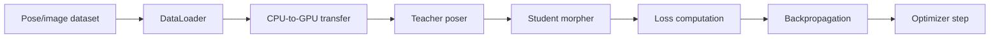
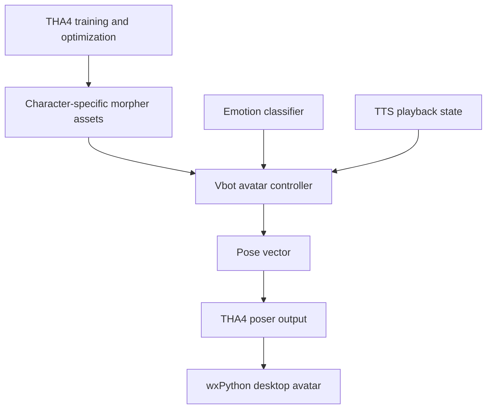

# THA4 Avatar Optimization

This page covers the deeper THA4 avatar engineering behind Vbot: the neural morphers, the distillation training path, and the GPU bottleneck analysis that makes character iteration practical.

The live desktop animation loop is documented separately in [ANIMATION.md](ANIMATION.md). That page explains how Vbot drives emotion, idle movement, and speaking motion at runtime. This page focuses on the heavier training and performance side.

## Why This Page Exists

Vbot's avatar layer is not just a static image with a mouth toggle. The project uses THA4 as a neural avatar framework, then adds a runtime controller around it for character selection, expression control, speaking state, and fallback rendering.

The difficult part is that character iteration can become slow if the THA4 student models are expensive to train. The existing THA4 notes in this repository analyze that problem as a GPU systems issue:

- which parts of training live on the GPU
- whether the bottleneck is VRAM, compute, memory bandwidth, or the data pipeline
- how CPU-to-GPU transfer patterns affect the training loop
- why mixed precision and channels-last tensors matter for this workload
- how the same avatar stack can remain practical inside a desktop AI assistant

## System Boundary

| Layer | Main Files | Role |
| --- | --- | --- |
| Runtime avatar control | `utils/avatar.py`, `tha4/app/animations/*.py` | Selects character assets, maps emotions to pose parameters, adds idle and speaking motion, renders frames |
| THA4 poser/morpher stack | `tha4/poser/`, `tha4/nn/siren/` | Neural posing and SIREN-based morphing for character images |
| THA4 training loop | `tha4/shion/core/training/`, `tha4/nn/siren/*_trainer.py` | Distills avatar morphers from teacher behavior into student models |
| Optimization analysis | `docs/THA4_*.md`, `docs/SM.md`, `docs/presentation-for-avatar-training.md` | Documents GPU architecture, training bottlenecks, and performance levers |

## THA4 Distillation Shape

The THA4 distillation setup has two major student-model targets:

| Target | Resolution | Purpose |
| --- | --- | --- |
| Face morpher | 128 x 128 | Learns facial expression deformation |
| Body morpher | 512 x 512 with 128/256/512 levels | Learns larger upper-body and full avatar deformation |

The training loop follows this shape:

The teacher poser remains on the GPU during training. Student morphers learn to reproduce the useful avatar deformation path with lower runtime cost and character-specific behavior.

For the lower-level SIREN morpher math behind pose-conditioned deformation, see [ANIMATION_MATH.md](ANIMATION_MATH.md).

## Bottleneck Diagnosis

The old instinct for slow neural training is to blame VRAM or buy a larger GPU. The THA4 analysis points somewhere more specific.

The repository's THA4 performance notes describe a bandwidth-sensitive workload:

| Signal | Meaning |
| --- | --- |
| Batch size capped around 8 in the THA4 distiller UI/config | More VRAM does not automatically unlock a larger batch |
| Body morpher estimated around 1.4-2.2 GB VRAM per GPU | Modern GPUs were not being filled by memory capacity alone |
| Face morpher estimated around 0.8-1.2 GB VRAM per GPU | Same pattern: not primarily a VRAM-capacity problem |
| SM utilization around 60-65 percent with memory utilization around 75-85 percent | Compute cores are waiting on memory movement |
| DataLoader path uses synchronous batch transfer in the current training code | CPU-to-GPU transfer can block the training loop |
| FP32 training moves twice as many bytes as FP16 | Memory traffic becomes expensive before raw compute is saturated |

The key conclusion: the training path is better understood as memory-bandwidth and data-pipeline limited, not simply VRAM-limited.

## Why Mixed Precision Helps

Mixed precision matters here because it attacks the bottleneck directly.

FP32 stores most tensor values with 4 bytes. FP16 stores them with 2 bytes. For a bandwidth-sensitive avatar morpher workload, that means:

- less memory traffic per activation, gradient, and parameter update
- better use of Tensor Cores on supported NVIDIA GPUs
- lower VRAM pressure as a side effect
- faster iteration when combined with stable loss scaling

The existing THA4 training presentation records this as the main reason the training path can move from slow multi-day iteration toward a much tighter character-training loop.

## Data Pipeline and Transfer Optimizations

The THA4 notes also identify the data pipeline as a major part of the speed story. A GPU can be powerful and still wait if batches arrive late or transfers block the training step.

Important levers from the existing analysis:

| Lever | Why It Matters |
| --- | --- |
| `pin_memory=True` | Enables faster host-to-device transfer from pinned CPU memory |
| `non_blocking=True` on `.to(device)` | Allows transfer to overlap with GPU work when source memory is pinned |
| `num_workers` tuning | Prevents CPU-side data loading from starving the GPU |
| `persistent_workers=True` | Avoids worker startup cost between epochs |
| `prefetch_factor` | Keeps upcoming batches ready before the GPU requests them |
| PyTorch profiler | Shows whether time is spent waiting on data, transfer, or kernels |
| `nvidia-smi dmon -s pucm` | Separates SM utilization from memory utilization during training |

This is why the optimization story is not just "turn on FP16." The better framing is:

1. reduce bytes moved per step
2. overlap transfers with useful work
3. feed the GPU consistently
4. use hardware-specific kernels where they help

## Kernel and Tensor Layout Choices

The THA4 analysis also calls out kernel-selection and tensor-layout choices:

| Technique | Role |
| --- | --- |
| `torch.backends.cudnn.benchmark = True` | Lets cuDNN pick faster kernels for stable input shapes |
| TF32 on Ampere-class GPUs | Speeds matrix operations while keeping an FP32-like workflow for some ops |
| Channels-last tensors | Improves convolution memory access patterns on modern NVIDIA GPUs |
| AMP with `GradScaler` | Keeps FP16 training stable by scaling losses before backward pass |

These choices compound. A single optimization may produce a modest gain, but together they reduce memory traffic, improve kernel choice, and reduce data stalls.

## Reported Training Impact

The existing avatar-training presentation records the optimization target/result as approximately:

| Scenario | Before | After |
| --- | --- | --- |
| Single local THA4 model training | about 4 days | about 1.4 days |
| Three-model cloud run | about 14 days | about 5 days |
| GPU utilization | around 60-65 percent | around 88-92 percent |
| RTX 3080 Ti VRAM usage | about 8.5 GB | about 5.8 GB |

The important point is not just the speedup number. The more useful engineering lesson is the diagnosis: more VRAM was not the main missing piece. Better memory traffic, transfer overlap, and GPU feeding were.

## Runtime Payoff

The training optimization work supports Vbot indirectly. It makes character iteration more practical, while the live application focuses on stable runtime behavior:

- fixed 512 x 512 avatar render target
- THA4 poser loaded once for the active character
- `float16` pose tensor in the runtime avatar controller
- transparent wx bitmap conversion for desktop rendering
- AI upscaling disabled in the runtime path to avoid unpredictable latency
- fallback static rendering if poser output fails
- explicit cleanup of cached frames and CUDA allocations

At runtime, the avatar controller does not retrain THA4. It drives trained assets with emotion and speaking-state parameters. The training optimization notes explain how those trained avatar assets can be produced and iterated on more efficiently.

## Relationship to Vbot Animation

The runtime controller is where Vbot's character behavior lives. The THA4 optimization work is what makes the avatar asset pipeline less painful to iterate.

## Evidence Trail

| Source | What It Contributes |
| --- | --- |
| [docs/presentation-for-avatar-training.md](docs/presentation-for-avatar-training.md) | Training optimization narrative, bandwidth diagnosis, reported speedup numbers |
| [docs/THA4_GPU_Architecture_Analysis.md](docs/THA4_GPU_Architecture_Analysis.md) | GPU memory breakdown, training flow, current bottleneck analysis |
| [docs/THA4_Performance_Summary.md](docs/THA4_Performance_Summary.md) | Executive summary of performance findings |
| [docs/THA4_Optimization_Recommendations.md](docs/THA4_Optimization_Recommendations.md) | Detailed optimization techniques for the THA4 training loop |
| [docs/SM.md](docs/SM.md) | Streaming multiprocessor explanation and utilization diagnosis |
| [utils/avatar.py](utils/avatar.py) | Current Vbot runtime avatar controller |

## Short Version

Vbot uses THA4 for neural avatar rendering, then adds a runtime controller for emotion, speaking motion, character switching, and desktop rendering. The deeper THA4 work is interesting because the training bottleneck was diagnosed as memory-bandwidth and data-pipeline limited, not simply VRAM-limited. That led to an optimization story around FP16, Tensor Cores, channels-last tensors, pinned memory, async transfers, and better DataLoader behavior.
