# Vbot MLOps and LLMOps Architecture

Last reviewed: 2026-07-07

This document describes the closed-loop model operations architecture for
Vbot. It sits above the individual evaluation details in
[EVALUATION.md](../EVALUATION.md): the evaluation page explains what each
gate measures, while this page explains how data, model changes, prompt
changes, runtime telemetry, and alerts feed each other.

Vbot is a single-user desktop ML app, not a hosted multi-tenant service.
The architecture is therefore intentionally practical: versioned datasets,
committed baselines, manual GPU evaluation, runtime telemetry, scheduled
monitoring, and issue-based follow-up. It does not pretend to have canary
deployments, shadow traffic, or service-mesh observability that the app
does not actually run.

## Lifecycle Diagram

```mermaid
flowchart LR
    source["Source audio and text prompts"] --> prep["Audio segmentation and data checks"]
    prep --> review["Human segment review"]
    review --> export["StyleTTS2 export lists"]
    export --> train["Voice fine-tuning"]

    prompts["Versioned character prompts"] --> llm_eval["LLM benchmark"]
    train --> tts_eval["TTS objective eval"]
    source --> emotion_eval["Emotion routing eval"]
    llm_eval --> judge["Persona judge"]

    emotion_eval --> gates["Regression and promotion gates"]
    tts_eval --> gates
    judge --> gates
    gates --> baselines["Committed baselines"]
    gates --> cards["Model cards and scorecards"]

    baselines --> model_ci["Manual Model CI"]
    prompts --> model_ci
    model_ci --> release["Desktop app/runtime"]
    cards --> release

    release --> telemetry["Runtime JSONL telemetry"]
    telemetry --> monitor["Weekly SLO and drift gate"]
    monitor --> issues["GitHub issue on violation"]
    issues --> triage["Triage: prompt, model, data, or runtime fix"]
    triage --> source
    triage --> prompts
```



## Control Loops

Vbot has three related loops.

| Loop | Trigger | Gate | Output |
| --- | --- | --- | --- |
| Data and voice loop | New or changed voice data | data quality checks, human review, StyleTTS2 export checks, TTS objective gate, promotion gate | voice checkpoint candidate or rejected dataset |
| LLM behavior loop | Prompt edit or generator change | prompt registry versioning, LLM benchmark, persona judge, scorecard comparison | prompt version and benchmark artifacts |
| Runtime monitoring loop | Real desktop use | runtime SLOs and emotion-bucket drift gate | GitHub issue or pass artifact |

The loops share the same principle: a model or prompt change should land
with the artifact that proves it did not regress. JSON artifacts and
committed baselines are the source of truth; MLflow is only an optional
local index over those artifacts.

## Artifacts of Record

| Artifact | Location | Purpose |
| --- | --- | --- |
| Emotion baseline | [evaluation/baselines/emotion_eval_baseline.json](../evaluation/baselines/emotion_eval_baseline.json) | accepted emotion-routing behavior |
| Persona reference | [evaluation/baselines/persona_judged_reference.json](../evaluation/baselines/persona_judged_reference.json) | accepted LLM persona reference |
| TTS baselines | [evaluation/baselines/tts_objective_&lt;Character&gt;_baseline.json](../evaluation/baselines) | accepted voice quality per character |
| Runtime SLO budgets | [evaluation/monitoring_slos.json](../evaluation/monitoring_slos.json) | committed latency, completion, and drift budgets |
| Prompt registry | [utils/character_prompts.py](../utils/character_prompts.py) | prompt text plus per-character version metadata |
| Model cards | [docs/MODEL_CARDS.md](MODEL_CARDS.md) | shipped model summary and current eval numbers |
| Scorecard | [scripts/eval_summary.py](../scripts/eval_summary.py) | latest eval artifacts rendered into Markdown |
| Runtime telemetry | `asset/outputs/runtime_metrics/*.jsonl` | local per-turn production behavior, ignored from git |

Replacing a baseline file is a promotion decision. Changing an SLO budget
is an operations decision. Editing a character prompt semantically is an
LLMOps decision and requires a prompt version bump.

## Build-To-Promote Path

1. Prepare candidate data or behavior.
   - Voice data starts in [Data_prep](../Data_prep), passes the audio
     segmenter, human segment reviewer, and StyleTTS2 export checks.
   - LLM behavior starts in [utils/character_prompts.py](../utils/character_prompts.py).
     A semantic prompt edit bumps that character's `version`.

2. Run focused local evaluation.
   - Emotion routing: [scripts/emotion_eval.py](../scripts/emotion_eval.py)
   - LLM benchmark: [scripts/llm_benchmark.py](../scripts/llm_benchmark.py)
   - Persona judge: [scripts/persona_judge.py](../scripts/persona_judge.py)
   - TTS objective metrics: [scripts/tts_objective_eval.py](../scripts/tts_objective_eval.py)
   - Human TTS review: [new_tts_eval_form](../new_tts_eval_form)

3. Compare against the standing baseline.
   - Gated scripts exit nonzero on regression.
   - Human TTS promotion uses
     [new_tts_eval_form/promotion_gate.py](../new_tts_eval_form/promotion_gate.py).
   - The baseline registry procedure lives in
     [evaluation/baselines/README.md](../evaluation/baselines/README.md).

4. Promote by committing the evidence.
   - Candidate code/model references, updated baseline artifact, and
     model-card or scorecard updates should move together.
   - The git diff is the audit trail.

5. Run Model CI when the prepared GPU workstation is online.
   - [.github/workflows/model-eval.yml](../.github/workflows/model-eval.yml)
     is manual by design because it needs Docker/Ollama, local model
     assets, GPU inference, and up to 90 minutes.
   - Gate failures open or update a `model-eval-failure` GitHub issue.

## Runtime-To-Triage Path

Vbot logs per-interaction telemetry through
[utils/runtime_metrics.py](../utils/runtime_metrics.py). The logger is
stdlib-only and failure-safe so metrics never break a conversation turn.

Logged records can include:

- character and emotion.
- runtime path, either `simple` or `streaming`.
- LLM latency.
- TTS latency and audio duration.
- response word count.
- streaming chunk count, chunks played, time to first audio, and pipeline
  errors.

[scripts/metrics_report.py](../scripts/metrics_report.py) summarizes one
metrics file for local inspection. [scripts/monitoring_report.py](../scripts/monitoring_report.py)
turns the accumulated metrics into a scheduled gate.

The monitoring gate checks the current window, defaulting to the last
seven days, against [evaluation/monitoring_slos.json](../evaluation/monitoring_slos.json):

| Check | Budget |
| --- | --- |
| p95 LLM latency | `<= 3.0s` |
| p95 time to first audio | `<= 2.5s` |
| p95 TTS real-time factor | `<= 0.5` |
| streaming pipeline error rate | `<= 0.02` |
| streaming chunk completion rate | `>= 0.95` |
| emotion-bucket drift | total variation distance `<= 0.25` |

Every SLO has a minimum sample guard. Insufficient data is reported
explicitly and exits 0, because a monitor that fails when there is nothing
to measure becomes noise.

The scheduled workflow is
[.github/workflows/runtime-monitoring.yml](../.github/workflows/runtime-monitoring.yml).
It runs weekly on the self-hosted Windows runner, uploads a monitoring
artifact, and opens or updates a `runtime-monitoring` GitHub issue when an
SLO or drift check fails. The workflow becomes scheduled only after it is
merged to the default branch.

## Prompt Versioning

For the LLM side of Vbot, prompts are part of the model artifact. The
generator model can remain fixed while a prompt edit changes character
behavior, response length, TTS safety, or kayfabe behavior.

[utils/character_prompts.py](../utils/character_prompts.py) therefore
stores each character prompt with:

- `version`
- `updated`
- `note`
- `prompt`

The LLM benchmark stamps `prompt_versions` into its artifact and MLflow
params. The persona judge propagates those versions into judged artifacts.
This keeps comparisons honest: prompt v1 scores should not be treated as
equivalent to prompt v2 scores unless the change was explicitly evaluated.

Prompt change procedure:

1. Edit the prompt and bump the affected character version.
2. Run `scripts/llm_benchmark.py`.
3. Run `scripts/persona_judge.py` against the benchmark artifact.
4. Compare against the prior version's artifacts.
5. Land the prompt change and eval evidence together.

## CI Boundaries

The default CI workflow,
[.github/workflows/ci.yml](../.github/workflows/ci.yml), is deliberately
lightweight. It uses [requirements-ci.txt](../requirements-ci.txt) and
avoids CUDA, Docker, GUI/audio devices, and model downloads.

It verifies source contracts: prompt coverage, response cleanup, emotion
mapping, schema validation, runtime metrics behavior, promotion-gate
logic, baseline loading, and release configuration. It does not claim to
measure model quality.

Heavyweight checks belong to the prepared Windows GPU runner:

| Workflow | Trigger | Why separate |
| --- | --- | --- |
| [model-eval.yml](../.github/workflows/model-eval.yml) | manual | Docker/Ollama, GPU, voice checkpoints, long runtime |
| [runtime-monitoring.yml](../.github/workflows/runtime-monitoring.yml) | weekly plus manual | reads local runtime telemetry from the app workstation |
| [desktop-release.yml](../.github/workflows/desktop-release.yml) | manual/release path | packages the Windows desktop app with local assets |

## Failure Triage

| Signal | First question | Likely follow-up |
| --- | --- | --- |
| Emotion eval regression | Did the classifier, threshold, or bucket mapping change? | inspect confusion matrix, restore or update baseline with evidence |
| LLM benchmark regression | Did a prompt version, generator, or response filter change? | compare artifact responses, run persona judge, bump prompt version if needed |
| Persona judge regression | Is it a real kayfabe/persona issue or judge variance? | review judged responses, re-judge if rubric changed, avoid promoting blindly |
| TTS objective regression | Did speaker similarity drop or WER rise? | inspect generated audio, references, checkpoint, and transcript errors |
| Human TTS gate failure | Are listeners failing emotion recognition or naturalness? | collect more samples, revisit data/emotion style, do not promote candidate |
| Runtime SLO failure | Is it LLM latency, TTFA, TTS RTF, or streaming completion? | inspect metrics file, recent runtime changes, GPU load, and streaming path |
| Emotion drift alert | Did real usage shift or did classifier behavior change? | compare current and reference bucket distributions, inspect recent prompts/data |

## Explicit Non-Goals

- No canary or shadow deployment path. There is no production fleet or
  hidden traffic stream to mirror.
- No DVC layer at the current scale. Frozen eval datasets, committed
  seeds, generated artifacts, and git-reviewed baselines are sufficient.
- No scheduled full Model CI while the self-hosted runner is a user
  workstation. Manual dispatch prevents long GPU jobs from piling up.
- No MLflow dependency in CI. MLflow is useful locally, but JSON artifacts
  and committed baselines remain the durable interface.

## Quick Commands

```powershell
# Source-contract tests
& "C:\Users\peepz\.conda\envs\vbot\python.exe" -m pytest tests/ -q

# Local runtime metrics summary
python scripts/metrics_report.py

# Runtime monitoring gate and JSON artifact
python scripts/monitoring_report.py --json monitoring_report.json

# LLM prompt benchmark and judge
python scripts/llm_benchmark.py
python scripts/persona_judge.py
```
